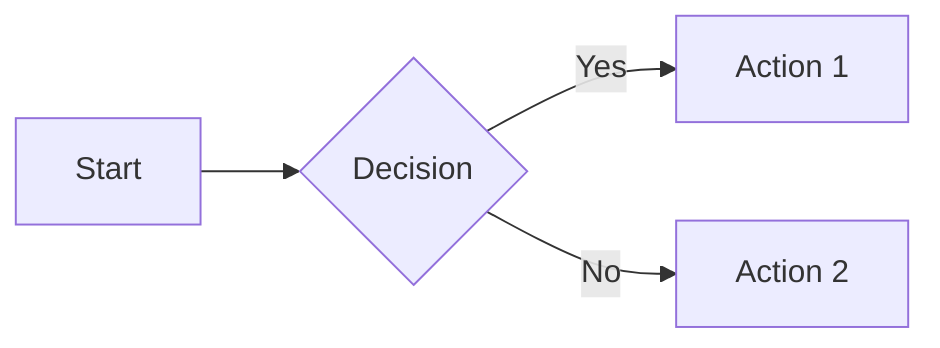
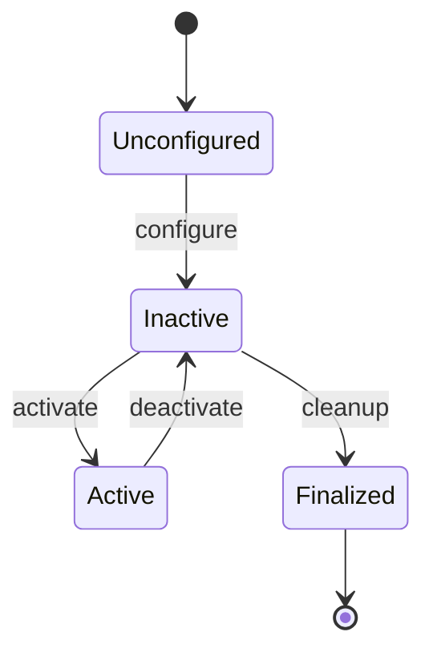

# Test: Mermaid Diagrams

## Simple Flowchart

```mermaid
graph LR
    A[Start] --> B{Decision}
    B -->|Yes| C[Action 1]
    B -->|No| D[Action 2]
```

## ROS 2 Publisher-Subscriber Pattern

```mermaid
graph LR
    A[Publisher Node]:::publisher -->|publishes| B[/topic/]:::topic
    B -->|subscribes| C[Subscriber Node]:::subscriber
    
    classDef publisher fill:#3498db,stroke:#2980b9,color:#fff
    classDef subscriber fill:#2ecc71,stroke:#27ae60,color:#fff
    classDef topic fill:#ecf0f1,stroke:#95a5a6,color:#333
```

## Node Lifecycle State Machine

```mermaid
stateDiagram-v2
    [*] --> Unconfigured
    Unconfigured --> Inactive: configure
    Inactive --> Active: activate
    Active --> Inactive: deactivate
    Inactive --> Finalized: cleanup
    Finalized --> [*]
```

If you see the diagrams above rendering correctly, Mermaid is working! ✅