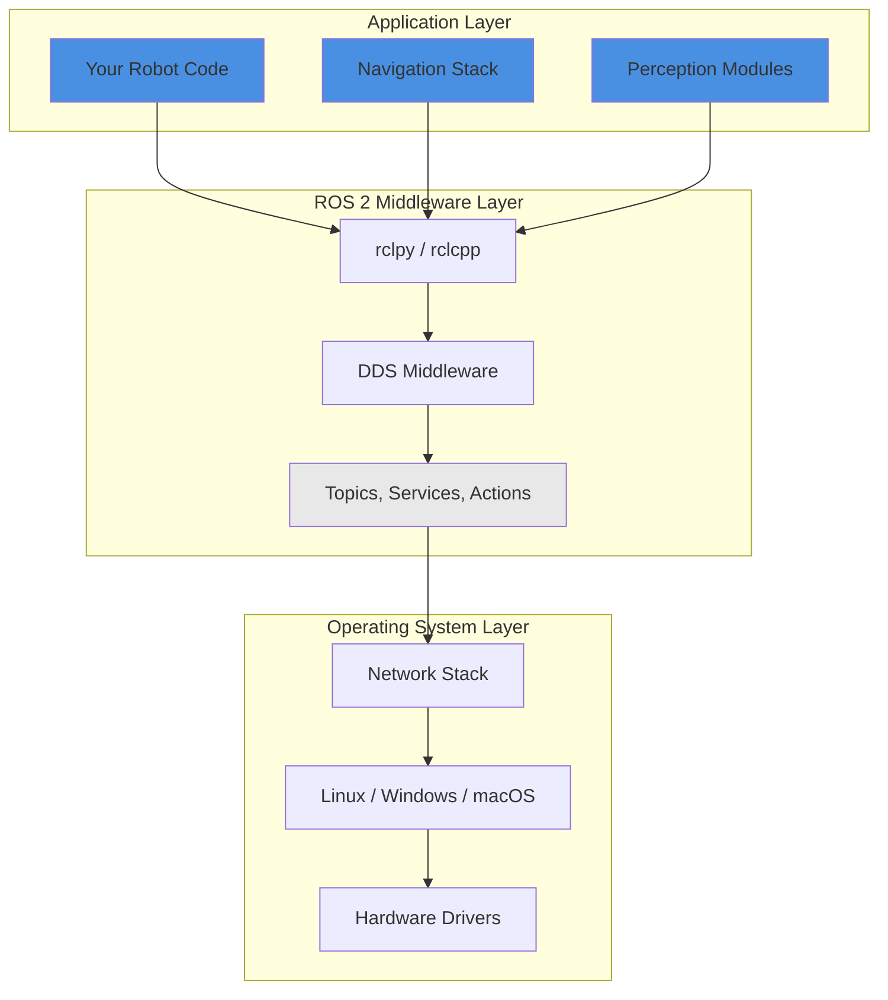

# Introduction to ROS 2

## Learning Objectives

By the end of this chapter, you will be able to:

- Explain what ROS 2 is and why it's essential for modern robotics development
- Identify key components of ROS 2 architecture (nodes, topics, and middleware)
- Create and run a simple "Hello World" ROS 2 node using Python
- Navigate official ROS 2 documentation to find package references and tutorials

## Introduction

Imagine trying to build a robot where the camera, motor controller, and decision-making AI all had to run in a single massive program. Every time you wanted to add a sensor or swap out a component, you'd need to rewrite core logic. This approach doesn't scale, and it's exactly why ROS 2 exists.

ROS 2 (Robot Operating System 2) is a middleware framework that lets different parts of your robot communicate seamlessly, even if they're written in different languages or running on different computers. Think of it as the nervous system for your robot—it connects sensors, actuators, and intelligence into a coordinated whole. Whether you're building a warehouse robot, a self-driving car, or a humanoid assistant, ROS 2 provides the communication infrastructure that makes modular robotics development possible.

In this chapter, you'll learn what ROS 2 is, why it replaced ROS 1, and how its architecture enables flexible robotics systems. You'll run your first ROS 2 node and see how components communicate. By the end, you'll understand why ROS 2 is the industry standard for physical AI systems, used by companies like NASA, BMW, Boston Dynamics, and countless robotics startups.

Before diving in, make sure you have basic Python knowledge (functions, classes, imports) and familiarity with command-line interfaces (navigating directories, running commands). We'll be using ROS 2 Humble, which is the recommended long-term support release.

## Core Concepts

### What is ROS 2?

Think of ROS 2 as the postal service for your robot. Just like mail carriers deliver letters between houses without each house needing to know the internal layout of others, ROS 2 delivers messages between different parts of your robot without tight coupling.

**ROS 2 (Robot Operating System 2)** is a middleware framework that provides communication infrastructure, hardware abstraction, and development tools for robotics applications. Despite its name, ROS 2 is not an operating system like Linux or Windows. Instead, it sits above your OS and provides standardized ways for robot components to discover each other and exchange data.

At its core, ROS 2 uses a publish-subscribe pattern where independent processes (called nodes) communicate via named message channels (called topics). This decoupled architecture means you can swap out a simulated camera for a real one without changing navigation code—they both publish to the same `/camera/image` topic. The navigation code doesn't need to know or care whether the camera is real or simulated.

This modularity is why companies like NASA (Mars rovers), BMW (factory automation), and Boston Dynamics (advanced robotics) use ROS 2. It enables teams to work on different components simultaneously, reuse code across projects, and build on a massive ecosystem of existing packages.

### ROS 2 Architecture: Three Layers

ROS 2's power comes from its layered architecture. Understanding these layers helps you see how your code fits into the larger ecosystem.



**Figure 1: ROS 2 Three-Layer Architecture**

1. **Application Layer**: This is where your robot code lives. You write nodes that implement specific behaviors—reading sensors, controlling motors, planning paths, making decisions. This layer uses ROS 2 client libraries (like `rclpy` for Python or `rclcpp` for C++).

2. **Middleware Layer**: ROS 2's communication backbone. This layer handles message serialization, network transport, service discovery, and Quality of Service (QoS) policies. It's built on DDS (Data Distribution Service), an industry-standard protocol used in defense, aerospace, and medical systems.

3. **Operating System Layer**: Standard Linux, Windows, or macOS. ROS 2 runs on all major platforms, which is a huge improvement over ROS 1 (which was Linux-only). The OS handles hardware access, networking, and process management.

This layered approach means you focus on robot logic while ROS 2 handles the messy details of inter-process communication, network protocols, and platform differences.

### Nodes: The Building Blocks

If ROS 2 were a city, nodes would be the buildings. Each building (node) has a specific purpose, and buildings communicate with each other via roads (topics, services, actions).

A **node** is an independent process that performs a specific computation. In practice, a node is a running program—when you execute `python3 my_robot.py`, you're starting a node. Nodes can:

- Publish sensor data (camera node publishes images)
- Process information (vision node detects objects in images)
- Control hardware (motor controller node sends commands to wheels)
- Make decisions (planner node computes navigation paths)

The key insight: **one node does one thing well**. Instead of a monolithic 10,000-line program, you create 10 nodes with 1,000 lines each. This makes code easier to test, debug, reuse, and understand. If the camera node crashes, your motor controller keeps running. If you want to upgrade your camera, you just replace the camera node—nothing else needs to change.

Here's how two nodes might communicate:


**Figure 2: Multi-Node Communication Flow**

Each blue box is a separate node (separate process), and gray boxes are topics (message channels). Notice how the camera node doesn't know the object detection node exists—it just publishes images. This loose coupling is ROS 2's superpower.

### Topics: Communication Channels

Continuing the city analogy, if nodes are buildings, **topics** are the roads connecting them. A topic is a named bus over which nodes exchange messages.

Topics use a **publish-subscribe pattern**:
- **Publishers** send messages on a topic (like broadcasting on a radio station)
- **Subscribers** receive messages from a topic (like tuning in to that radio station)
- **Many-to-many**: Multiple publishers can send to the same topic, and multiple subscribers can receive from it

Think of a topic like a radio frequency. The weather station broadcasts on 101.5 FM without knowing who's listening. Your car radio, home radio, and smartphone can all tune in simultaneously. The broadcaster doesn't track listeners, and listeners don't need permission to tune in. This decoupling makes systems flexible and robust.

In ROS 2, topics have:
- **Name**: Like `/camera/image` or `/cmd_vel` (velocity commands)
- **Message Type**: Like `sensor_msgs/Image` or `geometry_msgs/Twist` (defines the data structure)
- **QoS Policy**: Reliability, durability, and latency settings (we'll cover this in Chapter 5)

When you run a node, it automatically discovers other nodes publishing or subscribing to the same topics. No manual configuration needed—ROS 2 handles service discovery through DDS.

### Middleware: DDS Under the Hood

You might wonder how nodes running on different computers discover each other and exchange messages. The answer is **DDS (Data Distribution Service)**, the middleware layer powering ROS 2.

**DDS** is a proven, industry-standard protocol for real-time, distributed systems. It's used in military drones, hospital operating rooms, and air traffic control systems—places where reliability and performance are life-or-death. ROS 2 adopted DDS because:

1. **Automatic discovery**: Nodes find each other without a central broker (unlike ROS 1's roscore)
2. **QoS policies**: Fine-grained control over reliability, latency, and bandwidth
3. **Security**: Built-in encryption and authentication (critical for production robots)
4. **Performance**: Zero-copy messaging and real-time support
5. **Multi-platform**: Works on Linux, Windows, macOS, and embedded systems

As a ROS 2 developer, you rarely interact with DDS directly—ROS 2's client libraries abstract it away. But understanding that DDS powers your robot helps you appreciate why ROS 2 is more robust and scalable than ROS 1.

### Why ROS 2 vs. ROS 1?

If you've heard of ROS (now called ROS 1), you might wonder why ROS 2 was created. ROS 1 was groundbreaking when released in 2007, but it had limitations:

- **Single point of failure**: The roscore master node—if it crashed, your entire robot stopped
- **No real-time support**: Unpredictable message latency made it unsuitable for safety-critical systems
- **No security**: No encryption or authentication by default
- **Linux-only**: Couldn't run on Windows or embedded systems
- **Limited scalability**: Struggled with large fleets of robots or high-bandwidth sensors

ROS 2, launched in 2017, addressed all these issues. It's a complete redesign built on modern standards (DDS), with no single point of failure, built-in security, cross-platform support, and real-time capabilities. For new projects, ROS 2 is the clear choice. ROS 1 reached end-of-life in 2025, though legacy systems still use it.

## Practical Examples

### Example 1: Minimal "Hello World" Node

**Objective**: Create the simplest possible ROS 2 node that logs a message, demonstrating node initialization and the rclpy logging API.

**Prerequisites**:
- ROS 2 Humble installed and sourced (`source /opt/ros/humble/setup.bash`)
- Python 3.10+ with rclpy available
- Basic understanding of Python classes

#### Code

```python
#!/usr/bin/env python3
"""
Minimal ROS 2 node demonstrating basic node structure.
This is the foundation for all ROS 2 Python programs.
"""
import rclpy
from rclpy.node import Node


class HelloWorldNode(Node):
    """
    Minimal ROS 2 node that logs a greeting message.
    Demonstrates node initialization and rclpy logging.
    """

    def __init__(self):
        # Initialize the parent Node class with a unique name
        # This name appears in logs and must be unique in the namespace
        super().__init__('hello_world')

        # Log an info message (visible in terminal)
        # ROS 2 logging is better than print() for production systems
        self.get_logger().info('Hello, ROS 2 World!')


def main(args=None):
    # Step 1: Initialize the ROS 2 Python client library
    # Must be called before any ROS operations
    rclpy.init(args=args)

    # Step 2: Create an instance of our node
    # Constructor runs immediately, logging the message
    node = HelloWorldNode()

    # Step 3: Keep the node alive, processing callbacks
    # Spin blocks until Ctrl+C (SIGINT) is received
    rclpy.spin(node)

    # Step 4: Clean shutdown when spin exits
    node.destroy_node()
    rclpy.shutdown()


if __name__ == '__main__':
    main()
```

#### How to Run

```bash
# Step 1: Source ROS 2 environment (if not in ~/.bashrc)
source /opt/ros/humble/setup.bash

# Step 2: Save the code above to a file
nano hello_world.py
# Paste the code, then Ctrl+X, Y, Enter to save

# Step 3: Run the node directly with Python
python3 hello_world.py
```

#### Expected Output

```
[INFO] [1701234567.123456789] [hello_world]: Hello, ROS 2 World!
```

The node will then keep running (spin blocks). Press `Ctrl+C` to stop it:

```
^C[INFO] [1701234567.456789012] [rclpy]: signal_handler(signum=2)
[INFO] [1701234567.456890123] [rclpy]: signal received, shutting down
```

#### Explanation

This example demonstrates the fundamental lifecycle of every ROS 2 node: initialize → create → spin → shutdown. The `rclpy.init()` call sets up the ROS 2 client library. The `Node` class provides core functionality like logging via `get_logger()`. The `rclpy.spin()` function keeps the node alive, processing any callbacks (though this simple node has none). When you press Ctrl+C, spin exits and the cleanup code runs.

Notice we use `self.get_logger().info()` instead of `print()`. ROS 2's logging system automatically adds timestamps, log levels (INFO, WARN, ERROR), and node names. This makes debugging large systems much easier—you can filter logs by node, redirect them to files, or adjust verbosity without changing code.

**Key Takeaway**: All ROS 2 nodes follow the init → create → spin → shutdown pattern.

---

### Example 2: Discovering Running Nodes

**Objective**: Learn how to inspect the ROS 2 system using command-line tools to see active nodes and their properties.

**Prerequisites**:
- Example 1 code saved and ready to run
- ROS 2 environment sourced in your terminal

#### Code

No code to write—this example uses ROS 2's command-line interface (CLI).

#### How to Run

```bash
# Step 1: Open a terminal and run the Hello World node
# (Leave this terminal running for the remaining steps)
python3 hello_world.py

# Step 2: Open a SECOND terminal and source ROS 2
source /opt/ros/humble/setup.bash

# Step 3: List all running nodes
ros2 node list

# Step 4: Get detailed info about the hello_world node
ros2 node info /hello_world
```

#### Expected Output

**Terminal 1** (running node):
```
[INFO] [1701234567.123456789] [hello_world]: Hello, ROS 2 World!
```

**Terminal 2** (inspecting system):
```bash
$ ros2 node list
/hello_world

$ ros2 node info /hello_world
/hello_world
  Subscribers:

  Publishers:
    /parameter_events: rcl_interfaces/msg/ParameterEvent
    /rosout: rcl_interfaces/msg/Log
  Service Servers:
    /hello_world/describe_parameters: rcl_interfaces/srv/DescribeParameters
    /hello_world/get_parameter_types: rcl_interfaces/srv/GetParameterTypes
    /hello_world/get_parameters: rcl_interfaces/srv/GetParameters
    /hello_world/list_parameters: rcl_interfaces/srv/ListParameters
    /hello_world/set_parameters: rcl_interfaces/srv/SetParameters
    /hello_world/set_parameters_atomically: rcl_interfaces/srv/SetParametersAtomically
  Service Clients:

  Action Servers:

  Action Clients:
```

#### Explanation

ROS 2's CLI tools are invaluable for understanding your running system. The `ros2 node list` command shows all active nodes—useful for verifying your node started correctly. The `ros2 node info` command reveals everything a node does: topics it publishes/subscribes to, services it offers, and actions it handles.

Notice our simple Hello World node already publishes to `/rosout` (ROS 2's logging infrastructure) and `/parameter_events` (parameter change notifications). It also offers several parameter-related services automatically. Every ROS 2 node gets this infrastructure for free—you didn't have to write any code for parameter management.

These CLI tools become essential when debugging multi-node systems. You can inspect message flow, verify connections, and troubleshoot communication issues without modifying code.

**Key Takeaway**: Use `ros2 node list` and `ros2 node info` to inspect your running ROS 2 system.

## Hands-on Exercise

### Exercise 1: Custom Greeter Node

**Difficulty**: Beginner

**Objective**: Modify the Hello World node to print a personalized greeting with your name and the current timestamp.

**Estimated Time**: 10-15 minutes

**Instructions**:
1. Copy the `hello_world.py` code from Example 1 to a new file named `greeter.py`
2. Add the following import at the top of the file: `from datetime import datetime`
3. In the `HelloWorldNode` class constructor (the `__init__` method), change the node name from `'hello_world'` to `'greeter'`
4. Modify the log message to include your name (e.g., "Hello from Alice!")
5. Add a second log message that prints the current date and time using `datetime.now()`
6. Run your modified node with `python3 greeter.py`
7. In a second terminal, verify the node appears as `/greeter` using `ros2 node list`
8. Stop the node with Ctrl+C and observe the shutdown messages

**Success Criteria**:
- [ ] Node name appears as `greeter` in `ros2 node list` output
- [ ] First log message includes your actual name
- [ ] Second log message displays the current timestamp in a readable format
- [ ] Node runs without errors and responds to Ctrl+C gracefully
- [ ] Code follows proper indentation and Python style

**Hints** (click to expand):

<details>
<summary>Hint 1: Where to change the node name</summary>

The node name is set in the `super().__init__()` call inside the `HelloWorldNode` constructor, around line 16. Change `'hello_world'` to `'greeter'`.
</details>

<details>
<summary>Hint 2: Adding the datetime import</summary>

Add `from datetime import datetime` near the top of the file, after the `rclpy` imports. Then use `datetime.now()` to get the current time, and format it in your log message with an f-string: `self.get_logger().info(f'Current time: {datetime.now()}')`
</details>

<details>
<summary>Hint 3: Logging multiple messages</summary>

You can call `self.get_logger().info()` multiple times in the `__init__` method. Each call produces a separate log line in the terminal.
</details>

<details>
<summary>Hint 4: Formatting the timestamp</summary>

To make the timestamp more readable, use `.strftime()` method: `datetime.now().strftime('%Y-%m-%d %H:%M:%S')`. This gives you output like `2025-11-29 14:30:45`.
</details>

**Extension Challenge** (optional):
- Instead of logging once on startup, use a timer callback to print a greeting every 2 seconds. Research `self.create_timer()` in the ROS 2 documentation—this previews concepts from Chapter 3 on periodic callbacks.

## Common Pitfalls

### Pitfall 1: Forgetting to Source ROS 2 Setup

**What happens**: When you try to run `ros2` commands or import `rclpy` in Python, you get errors like:
```
bash: ros2: command not found
```
or
```
ModuleNotFoundError: No module named 'rclpy'
```

**Why it happens**: ROS 2 isn't in your system's PATH or PYTHONPATH by default. The `setup.bash` script adds ROS 2 executables and Python packages to your environment, but it only affects the current terminal session. Each new terminal starts fresh without ROS 2 in scope.

**How to fix it**:
1. Open your terminal
2. Run: `source /opt/ros/humble/setup.bash`
3. Verify ROS 2 is available: `ros2 --version`
4. You should see output like `ros2 cli version 0.18.x`
5. Now run your Python script or ROS 2 commands

**How to avoid it**: Add the source command to your shell's startup file so it runs automatically:

```bash
echo "source /opt/ros/humble/setup.bash" >> ~/.bashrc
source ~/.bashrc
```

Now every new terminal will have ROS 2 available automatically. Just be aware: if you later create a workspace, you'll need to source that workspace's `setup.bash` instead (covered in Chapter 2).

**Related error messages**:
```
bash: ros2: command not found
ModuleNotFoundError: No module named 'rclpy'
ImportError: cannot import name 'Node' from 'rclpy'
```

---

### Pitfall 2: Node Name Conflicts

**What happens**: You try to run two nodes with the same name and get a warning, or one node refuses to start:

```
[WARN] [1701234567.123456789] [rclpy]: Node name 'hello_world' conflicts with an existing node
```

In severe cases, the second node might fail to initialize or exhibit unpredictable behavior.

**Why it happens**: ROS 2 node names must be unique within a namespace. While ROS 2 can sometimes handle duplicate names by remapping, it's a code smell that indicates poor architecture. Having two nodes with the same name makes debugging difficult—which node's logs are you seeing? Which one is publishing messages?

**How to fix it**:
1. Check running nodes: `ros2 node list`
2. Stop the conflicting node (Ctrl+C in its terminal)
3. Or, rename your node by changing the string passed to `super().__init__('node_name')` in your code
4. Use descriptive, unique names like `camera_front`, `lidar_processor`, or `navigation_controller`

**How to avoid it**: Develop a naming convention for your project. Good patterns include:
- Prefix with function: `camera_left`, `camera_right`
- Include hardware location: `wheel_front_left`, `wheel_rear_right`
- Describe the computation: `object_detector`, `path_planner`

Avoid generic names like `node`, `test`, `my_node`, or `robot`. These are likely to conflict when you scale up to multi-node systems.

**Related error messages**:
```
[WARN] [rclpy]: Node name 'X' conflicts with an existing node
RuntimeError: node name 'X' already exists
```

---

### Pitfall 3: Running Node Without Spin

**What happens**: Your node starts, logs a message, and immediately exits:

```
[INFO] [1701234567.123456789] [hello_world]: Hello, ROS 2 World!
# Program exits immediately, no error message
```

You expected the node to keep running, but it quits instantly.

**Why it happens**: You forgot to call `rclpy.spin(node)`, or you called it but then immediately destroyed the node. Without `spin()`, the program reaches the end of `main()` and exits. The `spin()` function is a blocking call that keeps the node alive, processing callbacks until you press Ctrl+C.

**How to fix it**:
1. Open your Python script
2. Ensure you have these lines in order:
   ```python
   rclpy.init(args=args)
   node = HelloWorldNode()
   rclpy.spin(node)  # Blocks here until Ctrl+C
   node.destroy_node()
   rclpy.shutdown()
   ```
3. Make sure `rclpy.spin()` comes AFTER node creation and BEFORE cleanup
4. Verify the cleanup code only runs after spin exits (when you press Ctrl+C)

**How to avoid it**: Always follow the init → create → spin → shutdown pattern. Think of `spin()` as the "keep alive" function—without it, your node is like a server that starts and immediately shuts down.

For nodes that need to do work and then exit (like one-time data processing), you can use `rclpy.spin_once()` or `rclpy.spin_until_future_completes()`, but most robot nodes should run continuously with `spin()`.

**Related symptoms**:
- Node exits immediately after logging
- Subscribers never receive messages (node exited before messages arrived)
- Timers never fire (node didn't stay alive long enough)

## Summary

In this chapter, you learned what ROS 2 is, why it's the standard framework for modern robotics, and ran your first ROS 2 node.

Key takeaways:

- **ROS 2 is a middleware framework**: It provides communication infrastructure that decouples robot components, enabling modular development and code reuse across projects
- **Three-layer architecture**: Application code (your nodes) sits on top of ROS 2 middleware (DDS-based communication), which runs on standard operating systems (Linux, Windows, macOS)
- **Nodes are building blocks**: Every ROS 2 program is a node—an independent process that communicates with other nodes via topics, services, or actions
- **Topics enable publish-subscribe**: Publishers broadcast messages on named channels; subscribers listen without tight coupling; multiple nodes can publish/subscribe to the same topic
- **DDS provides the foundation**: The Data Distribution Service middleware gives ROS 2 automatic discovery, QoS policies, security, real-time support, and cross-platform compatibility
- **CLI tools for introspection**: Use `ros2 node list` and `ros2 node info` to inspect running systems, verify connections, and debug communication issues

You created a minimal Python node using rclpy, understanding the init → create → spin → shutdown lifecycle that all ROS 2 nodes follow. You also learned how to avoid common beginner mistakes like forgetting to source the ROS 2 environment or running nodes without calling `spin()`.

In the next chapter, you'll dive deeper into nodes—learning about lifecycle management, parameters, logging levels, and creating multi-node systems with publishers and subscribers.

## Further Reading

- **[Official ROS 2 Humble Documentation](https://docs.ros.org/en/humble/)** - Comprehensive reference for all ROS 2 Humble packages, APIs, tutorials, and concepts
- **[ROS 2 Design Principles](https://design.ros2.org/)** - Deep dive into architectural decisions and why ROS 2 was built the way it is
- **[ROS 2 Tutorials - Beginner Level](https://docs.ros.org/en/humble/Tutorials/Beginner.html)** - Step-by-step official tutorials covering nodes, topics, services, parameters, and more
- **[ROS Discourse Forum](https://discourse.ros.org/)** - Community forum for asking questions, troubleshooting issues, and discussing ROS 2 development
- **[The Robotics Back-End Blog](https://roboticsbackend.com/)** - Clear tutorials and explanations of ROS 2 concepts with practical examples

Want more practice? Try extending the greeter node to accept a command-line argument for the name instead of hardcoding it, or create a second node that discovers and logs information about the greeter node programmatically using the ROS 2 API.
