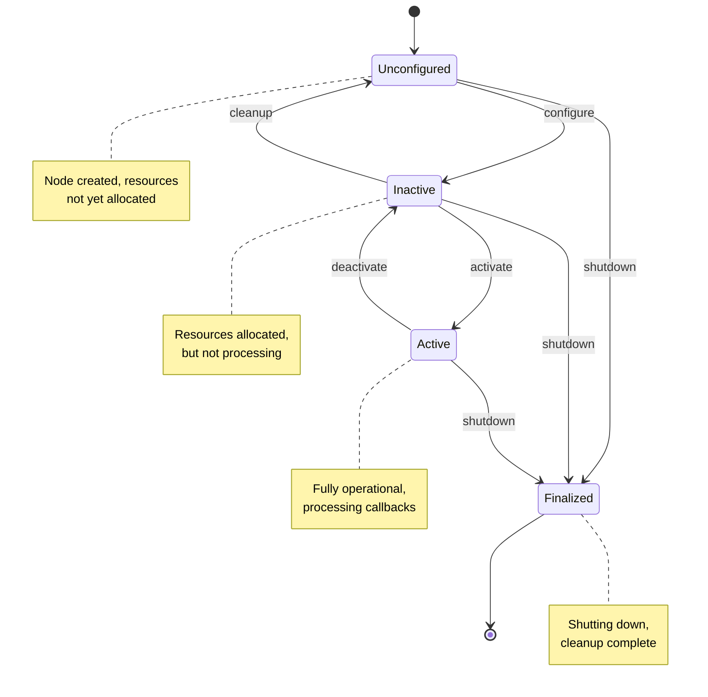

# ROS 2 Nodes

## Learning Objectives

By the end of this chapter, you will be able to:

- Create custom ROS 2 nodes using the rclpy.Node class with proper initialization
- Explain the ROS 2 node lifecycle and state transitions from unconfigured to finalized
- Use ROS 2's logging system effectively with different severity levels (DEBUG, INFO, WARN, ERROR, FATAL)
- Declare and retrieve node parameters for runtime configuration without code changes
- Apply node naming conventions to avoid conflicts in multi-node systems

## Introduction

Picture a team of specialists building a house: the electrician wires the lights, the plumber installs pipes, and the carpenter frames walls. Each works independently but coordinates through a shared blueprint. In ROS 2, nodes work the same way—each is an independent process with a specialized job, coordinating through standardized communication.

In Chapter 1, you created a minimal "Hello World" node and learned that nodes are ROS 2's fundamental building blocks. But real robots need more than simple nodes—they need nodes that can be configured without recompiling code, log detailed diagnostic information, and gracefully start up and shut down. This chapter teaches you to build professional-grade nodes using the full power of the rclpy.Node class.

You'll learn about the node lifecycle (how nodes transition from startup to shutdown), the logging system (better than print statements for debugging), and parameters (runtime configuration without code changes). These skills are essential for building robots that can be deployed in production, not just tested on your laptop. By the end, you'll create nodes that are configurable, maintainable, and debuggable—the hallmarks of professional robotics code.

Before diving in, make sure you've completed Chapter 1 and can create and run a basic ROS 2 node. We'll build directly on that foundation.

## Core Concepts

### The rclpy.Node Class

Think of the Node class as the Swiss Army knife of ROS 2. Just as a Swiss Army knife bundles many tools into one handle, the Node class bundles all the capabilities a ROS 2 process needs: publishing, subscribing, logging, timers, parameters, and more.

The **rclpy.Node class** is the base class for all Python ROS 2 nodes. When you inherit from Node and call `super().__init__('node_name')`, you gain access to methods like `create_publisher()`, `create_subscription()`, `create_timer()`, `get_logger()`, and `declare_parameter()`. You don't build these from scratch—the Node class provides them automatically.

Every node needs a unique name (the string you pass to `__init__()`), which appears in logs, introspection tools like `ros2 node list`, and namespace hierarchies. The Node class also handles ROS 2's executor, which schedules callbacks (timer callbacks, subscription callbacks, service callbacks) on a single thread by default. Understanding the Node class is like understanding the foundation of a house—everything else builds on it.

Here's the minimal pattern you saw in Chapter 1, now with annotations:

```python
import rclpy
from rclpy.node import Node

class MyNode(Node):
    def __init__(self):
        # Call parent constructor with unique node name
        super().__init__('my_node')

        # All Node methods now available:
        # self.create_publisher(), self.create_subscription(),
        # self.create_timer(), self.get_logger(), etc.

def main():
    rclpy.init()           # Initialize ROS 2 client library
    node = MyNode()        # Instantiate your node
    rclpy.spin(node)       # Keep node alive, processing callbacks
    node.destroy_node()    # Clean up node resources
    rclpy.shutdown()       # Shutdown ROS 2 client library
```

The Node class abstracts away the complexity of ROS 2's middleware, letting you focus on your robot's logic instead of communication plumbing.

### Node Lifecycle and States

Imagine a robot on a factory floor. You don't want it to start moving the moment you power it on—you want it to boot up, run diagnostics, wait for a "go" signal, operate, then shut down gracefully when maintenance is needed. The ROS 2 lifecycle nodes formalize this process.

**Lifecycle nodes** (also called "managed nodes") implement a state machine with explicit transitions between states. While not all ROS 2 nodes are lifecycle nodes (simple nodes like our Hello World example skip this), understanding the lifecycle is crucial for production systems where controlled startup and shutdown matter.

The lifecycle state machine has four primary states:

1. **Unconfigured**: Node exists but isn't ready to operate. Resources not allocated, hardware not initialized.
2. **Inactive**: Node is configured (resources allocated, hardware initialized) but not actively processing. Like a car in park with the engine running.
3. **Active**: Node is fully operational. Publishers publishing, subscribers receiving, timers firing.
4. **Finalized**: Node is shutting down or has shut down. Resources released, cleanup complete.

Transitions between states are triggered by external commands (like `ros2 lifecycle set` in the CLI) or internal logic. For example:

- **configure** transition: Unconfigured → Inactive (allocate resources, initialize hardware)
- **activate** transition: Inactive → Active (start processing)
- **deactivate** transition: Active → Inactive (pause processing, keep resources)
- **cleanup** transition: Inactive → Unconfigured (release resources)
- **shutdown** transition: Any state → Finalized (emergency stop, cleanup)

Here's a simplified state diagram:



**Figure 1: ROS 2 Lifecycle Node State Machine**

Why does this matter? In production robots, you might need to reconfigure sensors, temporarily disable motors for safety, or perform diagnostics without fully restarting nodes. Lifecycle nodes make this explicit and safe. For this chapter's examples, we'll use standard nodes (which skip lifecycle management), but keep this concept in mind—Chapter 8 will cover lifecycle nodes in depth.

### Logging: Better Than Print Statements

If you've debugged code with print statements scattered everywhere, you know the pain: no timestamps, no way to filter messages, output mixed with other programs, and you have to delete all those prints before production. ROS 2's logging system solves these problems.

**ROS 2 logging** provides structured, severity-based logging that's automatically timestamped, filterable, and routable. Instead of `print("Value: ", x)`, you write `self.get_logger().info(f'Value: {x}')`. Here's why that's better:

1. **Timestamps**: Every log shows when it occurred (down to nanoseconds)
2. **Severity levels**: DEBUG, INFO, WARN, ERROR, FATAL let you filter noise
3. **Node identification**: Logs show which node produced them
4. **Centralized**: Logs go to `/rosout` topic, so tools can aggregate them
5. **No cleanup**: Leave logging code in production, just change severity thresholds

The five severity levels, from least to most urgent:

- **DEBUG**: Verbose details for debugging (usually disabled in production)
- **INFO**: Informational messages showing normal operation
- **WARN**: Something unexpected but not critical (e.g., sensor temporarily unavailable)
- **ERROR**: Something failed, but node can continue (e.g., failed to publish one message)
- **FATAL**: Critical failure, node cannot continue (e.g., hardware not found)

Example usage:

```python
# Inside a Node subclass
self.get_logger().debug('Detailed variable state for debugging')
self.get_logger().info('Robot initialized successfully')
self.get_logger().warn('Camera framerate lower than expected')
self.get_logger().error('Failed to read sensor, retrying...')
self.get_logger().fatal('Critical hardware failure, shutting down')
```

The logger automatically includes timestamps and node names in output:

```
[INFO] [1701234567.123456789] [my_node]: Robot initialized successfully
[WARN] [1701234567.234567890] [my_node]: Camera framerate lower than expected
```

You can filter logs at runtime without changing code:

```bash
# Show only WARN and above (hides DEBUG and INFO)
ros2 run my_package my_node --ros-args --log-level WARN
```

This makes ROS 2 logging vastly superior to print statements for any non-trivial robot system.

### Parameters: Runtime Configuration

Imagine you're tuning a robot's camera exposure. With hardcoded values, you'd change code, recompile, redeploy, and restart for every tweak—painful iteration. With parameters, you change a configuration file or runtime command—no recompilation needed.

**Parameters** are named values (integers, floats, strings, booleans, arrays) that configure node behavior at runtime. They're like function arguments, but set when the node starts or changed while it's running, without touching source code.

Every node has a parameter server built in (you saw this in Chapter 1's `ros2 node info` output). You declare parameters in your node's constructor, set defaults, and retrieve values when needed. Users can override defaults via command-line arguments or YAML configuration files.

Here's the workflow:

1. **Declare parameters** in node constructor with defaults:
   ```python
   self.declare_parameter('camera_fps', 30)
   self.declare_parameter('robot_name', 'RoboOne')
   ```

2. **Retrieve parameter values**:
   ```python
   fps = self.get_parameter('camera_fps').get_parameter_value().integer_value
   name = self.get_parameter('robot_name').get_parameter_value().string_value
   ```

3. **Override from command line**:
   ```bash
   ros2 run my_package my_node --ros-args -p camera_fps:=60 -p robot_name:="RoboTwo"
   ```

4. **Override from YAML file**:
   ```yaml
   # config.yaml
   my_node:
     ros__parameters:
       camera_fps: 60
       robot_name: "RoboTwo"
   ```
   ```bash
   ros2 run my_package my_node --ros-args --params-file config.yaml
   ```

Parameters shine in production deployments where different robots need different configurations (camera calibration, wheel diameter, sensor offsets) but run the same code. Declare parameters for anything users might want to configure, and your nodes become reusable across projects.

### Node Naming Conventions

You wouldn't name all your Python variables `var1`, `var2`, `var3`—you'd use descriptive names like `speed`, `distance`, `timestamp`. The same principle applies to node names.

**Node naming best practices**:

- **Descriptive**: Name indicates function (`camera_processor`, `wheel_controller`, not `node1`)
- **Unique**: No two nodes should share a name in the same namespace
- **Lowercase with underscores**: Follow Python naming conventions (`lidar_front`, not `LidarFront` or `lidar-front`)
- **Prefix by subsystem**: For large systems, prefix by domain (`perception_camera`, `control_motors`)

ROS 2 also supports **namespaces**, which group related nodes. For example, a multi-robot system might namespace nodes:

- `/robot1/camera`
- `/robot1/controller`
- `/robot2/camera`
- `/robot2/controller`

This prevents conflicts even with identical node names (both robots have a `camera` node, but in different namespaces). You set namespaces via command-line arguments:

```bash
ros2 run my_package my_node --ros-args -r __ns:=/robot1
```

Good naming isn't just pedantic—it's essential for debugging. When you see 20 nodes in `ros2 node list`, descriptive names like `lidar_front_processor` and `path_planner_astar` tell you exactly what's running. Names like `node1` and `node2` are useless.

## Practical Examples

### Example 1: Node with Multi-Level Logging

**Objective**: Create a node demonstrating all five logging levels (DEBUG, INFO, WARN, ERROR, FATAL) and show how to filter logs at runtime.

**Prerequisites**:
- ROS 2 Humble installed and sourced
- Understanding of Python classes from Chapter 1
- Basic familiarity with ROS 2 logging from Chapter 1

#### Code

```python
#!/usr/bin/env python3
"""
Demonstration of ROS 2's multi-level logging system.
Shows all five severity levels and runtime filtering.
"""
import rclpy
from rclpy.node import Node


class LoggerDemoNode(Node):
    """
    Node demonstrating ROS 2's five logging levels.
    Each level serves a different debugging purpose.
    """

    def __init__(self):
        # Initialize node with descriptive name
        super().__init__('logger_demo')

        # Log messages at all severity levels
        self.get_logger().debug('DEBUG: Detailed diagnostic information')
        self.get_logger().info('INFO: Node initialized successfully')
        self.get_logger().warn('WARN: This is a warning message')
        self.get_logger().error('ERROR: This is an error message')
        self.get_logger().fatal('FATAL: This is a fatal error message')

        # Create timer to log periodic status (demonstrates ongoing logging)
        self.counter = 0
        self.timer = self.create_timer(2.0, self.timer_callback)

    def timer_callback(self):
        """Called every 2 seconds to log current status."""
        self.counter += 1
        self.get_logger().info(f'Timer callback #{self.counter}')

        # Log warnings for odd counts (simulating occasional issues)
        if self.counter % 2 == 1:
            self.get_logger().warn(f'Odd count detected: {self.counter}')


def main(args=None):
    # Initialize ROS 2 Python client library
    rclpy.init(args=args)

    # Create logger demo node
    node = LoggerDemoNode()

    # Keep node running and processing callbacks
    try:
        rclpy.spin(node)
    except KeyboardInterrupt:
        # Graceful shutdown on Ctrl+C
        node.get_logger().info('Shutting down logger demo node')
    finally:
        # Cleanup
        node.destroy_node()
        rclpy.shutdown()


if __name__ == '__main__':
    main()
```

#### How to Run

```bash
# Step 1: Source ROS 2 environment
source /opt/ros/humble/setup.bash

# Step 2: Save code to file
nano logger_demo.py
# Paste code, Ctrl+X, Y, Enter to save

# Step 3: Run with default log level (INFO and above)
python3 logger_demo.py

# Step 4: In a new terminal, run with DEBUG level (shows all logs)
python3 logger_demo.py --ros-args --log-level DEBUG

# Step 5: In a new terminal, run with WARN level (hides INFO and DEBUG)
python3 logger_demo.py --ros-args --log-level WARN
```

#### Expected Output

**Default (INFO level)**:
```
[INFO] [1701234567.123456789] [logger_demo]: INFO: Node initialized successfully
[WARN] [1701234567.123456790] [logger_demo]: WARN: This is a warning message
[ERROR] [1701234567.123456791] [logger_demo]: ERROR: This is an error message
[FATAL] [1701234567.123456792] [logger_demo]: FATAL: This is a fatal error message
[INFO] [1701234569.123456789] [logger_demo]: Timer callback #1
[WARN] [1701234569.123456790] [logger_demo]: Odd count detected: 1
[INFO] [1701234571.123456789] [logger_demo]: Timer callback #2
[INFO] [1701234573.123456789] [logger_demo]: Timer callback #3
[WARN] [1701234573.123456790] [logger_demo]: Odd count detected: 3
```

Notice: DEBUG message doesn't appear (filtered out).

**DEBUG level** (all messages):
```
[DEBUG] [1701234567.123456788] [logger_demo]: DEBUG: Detailed diagnostic information
[INFO] [1701234567.123456789] [logger_demo]: INFO: Node initialized successfully
[WARN] [1701234567.123456790] [logger_demo]: WARN: This is a warning message
[ERROR] [1701234567.123456791] [logger_demo]: ERROR: This is an error message
[FATAL] [1701234567.123456792] [logger_demo]: FATAL: This is a fatal error message
```

**WARN level** (only WARN, ERROR, FATAL):
```
[WARN] [1701234567.123456790] [logger_demo]: WARN: This is a warning message
[ERROR] [1701234567.123456791] [logger_demo]: ERROR: This is an error message
[FATAL] [1701234567.123456792] [logger_demo]: FATAL: This is a fatal error message
[WARN] [1701234569.123456790] [logger_demo]: Odd count detected: 1
[WARN] [1701234573.123456790] [logger_demo]: Odd count detected: 3
```

#### Explanation

This example demonstrates ROS 2's severity-based logging. Each log level serves a purpose: DEBUG for verbose diagnostics during development, INFO for normal operation status, WARN for unexpected but non-critical issues, ERROR for failures that don't stop the node, and FATAL for critical failures.

The `--log-level` argument filters messages at runtime without code changes—essential for production systems where you want to reduce log volume but still have the option to enable DEBUG logging when troubleshooting. The timer callback shows how ongoing operations log status updates, with warnings logged conditionally based on runtime state.

**Key Takeaway**: Use appropriate log levels (DEBUG/INFO/WARN/ERROR/FATAL) and filter at runtime with `--log-level` to control logging verbosity.

---

### Example 2: Node with Configurable Parameters

**Objective**: Create a node that uses parameters for configuration, demonstrating parameter declaration, retrieval, and runtime override without code changes.

**Prerequisites**:
- Completed Example 1
- Understanding of Python data types (int, float, string, bool)

#### Code

```python
#!/usr/bin/env python3
"""
Node demonstrating parameter-based configuration.
Shows how to declare, retrieve, and use parameters for runtime config.
"""
import rclpy
from rclpy.node import Node


class ParameterizedNode(Node):
    """
    Node configured via parameters instead of hardcoded values.
    Makes the node reusable across different deployments.
    """

    def __init__(self):
        # Initialize node with descriptive name
        super().__init__('parameterized_node')

        # Declare parameters with default values
        # These can be overridden at runtime via CLI or YAML files
        self.declare_parameter('update_rate_hz', 1.0)
        self.declare_parameter('robot_name', 'DefaultRobot')
        self.declare_parameter('max_speed_mps', 2.0)
        self.declare_parameter('debug_mode', False)

        # Retrieve parameter values
        # Use get_parameter_value() to extract typed value from Parameter object
        update_rate = self.get_parameter('update_rate_hz').get_parameter_value().double_value
        self.robot_name = self.get_parameter('robot_name').get_parameter_value().string_value
        self.max_speed = self.get_parameter('max_speed_mps').get_parameter_value().double_value
        self.debug_mode = self.get_parameter('debug_mode').get_parameter_value().bool_value

        # Log retrieved configuration (helps verify parameters were set correctly)
        self.get_logger().info(f'Configuration loaded:')
        self.get_logger().info(f'  Robot Name: {self.robot_name}')
        self.get_logger().info(f'  Max Speed: {self.max_speed} m/s')
        self.get_logger().info(f'  Update Rate: {update_rate} Hz')
        self.get_logger().info(f'  Debug Mode: {self.debug_mode}')

        # Create timer with parameter-configured rate
        # Timer period = 1 / frequency (e.g., 1 Hz = 1.0 second period)
        timer_period = 1.0 / update_rate
        self.timer = self.create_timer(timer_period, self.timer_callback)

        self.iteration = 0

    def timer_callback(self):
        """Periodic callback using configuration from parameters."""
        self.iteration += 1

        # Log basic info every iteration
        self.get_logger().info(
            f'{self.robot_name} iteration {self.iteration} '
            f'(max speed: {self.max_speed} m/s)'
        )

        # Log extra debug info if debug mode enabled
        if self.debug_mode:
            self.get_logger().debug(
                f'Debug: Timer fired at iteration {self.iteration}'
            )


def main(args=None):
    # Initialize ROS 2 Python client library
    rclpy.init(args=args)

    # Create parameterized node (reads parameters during __init__)
    node = ParameterizedNode()

    # Keep node running and processing callbacks
    try:
        rclpy.spin(node)
    except KeyboardInterrupt:
        node.get_logger().info('Shutting down parameterized node')
    finally:
        node.destroy_node()
        rclpy.shutdown()


if __name__ == '__main__':
    main()
```

#### How to Run

```bash
# Step 1: Source ROS 2 environment
source /opt/ros/humble/setup.bash

# Step 2: Save code to file
nano parameterized_node.py
# Paste code, Ctrl+X, Y, Enter to save

# Step 3: Run with default parameters
python3 parameterized_node.py

# Step 4: Run with custom parameters via CLI
python3 parameterized_node.py --ros-args \
  -p update_rate_hz:=2.0 \
  -p robot_name:="SpeedyBot" \
  -p max_speed_mps:=5.0 \
  -p debug_mode:=true \
  --log-level DEBUG

# Step 5: Create YAML config file (alternative to CLI args)
cat > config.yaml << EOF
parameterized_node:
  ros__parameters:
    update_rate_hz: 0.5
    robot_name: "SlowBot"
    max_speed_mps: 1.0
    debug_mode: false
EOF

# Step 6: Run with YAML config file
python3 parameterized_node.py --ros-args --params-file config.yaml
```

#### Expected Output

**Default parameters**:
```
[INFO] [1701234567.123456789] [parameterized_node]: Configuration loaded:
[INFO] [1701234567.123456790] [parameterized_node]:   Robot Name: DefaultRobot
[INFO] [1701234567.123456791] [parameterized_node]:   Max Speed: 2.0 m/s
[INFO] [1701234567.123456792] [parameterized_node]:   Update Rate: 1.0 Hz
[INFO] [1701234567.123456793] [parameterized_node]:   Debug Mode: False
[INFO] [1701234568.123456789] [parameterized_node]: DefaultRobot iteration 1 (max speed: 2.0 m/s)
[INFO] [1701234569.123456789] [parameterized_node]: DefaultRobot iteration 2 (max speed: 2.0 m/s)
```

**Custom parameters via CLI** (2 Hz, debug enabled):
```
[INFO] [1701234567.123456789] [parameterized_node]: Configuration loaded:
[INFO] [1701234567.123456790] [parameterized_node]:   Robot Name: SpeedyBot
[INFO] [1701234567.123456791] [parameterized_node]:   Max Speed: 5.0 m/s
[INFO] [1701234567.123456792] [parameterized_node]:   Update Rate: 2.0 Hz
[INFO] [1701234567.123456793] [parameterized_node]:   Debug Mode: True
[INFO] [1701234567.623456789] [parameterized_node]: SpeedyBot iteration 1 (max speed: 5.0 m/s)
[DEBUG] [1701234567.623456790] [parameterized_node]: Debug: Timer fired at iteration 1
[INFO] [1701234568.123456789] [parameterized_node]: SpeedyBot iteration 2 (max speed: 5.0 m/s)
[DEBUG] [1701234568.123456790] [parameterized_node]: Debug: Timer fired at iteration 2
```

Notice timer fires twice per second (2 Hz) instead of once per second.

#### Explanation

This example demonstrates parameter-based configuration, a cornerstone of reusable ROS 2 code. By declaring parameters with defaults, the node can run immediately (sensible defaults) but can be reconfigured for different deployments without touching source code.

The `update_rate_hz` parameter controls timer frequency—critical for tuning performance (faster for real-time control, slower for low-power sensors). The `robot_name` and `max_speed_mps` parameters configure robot-specific values that vary by hardware. The `debug_mode` parameter conditionally enables verbose logging, allowing you to toggle debug output without recompiling.

Parameters can be set via command-line arguments (`-p name:=value`) or YAML files (`--params-file config.yaml`). YAML files are preferred for production—you version control configuration separately from code, making deployment across multiple robots straightforward.

**Key Takeaway**: Declare parameters for any configurable value; override defaults via CLI args or YAML files to avoid hardcoding.

## Hands-on Exercise

### Exercise 1: System Info Logger Node

**Difficulty**: Beginner

**Objective**: Create a node that periodically logs system information (CPU usage, memory, disk space) using parameters to configure logging frequency and debug verbosity.

**Estimated Time**: 15-20 minutes

**Instructions**:
1. Create a new file named `system_info_node.py`
2. Import `rclpy`, `rclpy.node.Node`, and Python's `psutil` library for system stats (install with `pip install psutil --break-system-packages`)
3. Create a class `SystemInfoNode` inheriting from `Node` with node name `'system_info_logger'`
4. Declare two parameters: `log_interval_sec` (default: 5.0) and `verbose` (default: False)
5. Retrieve the parameters and create a timer with period equal to `log_interval_sec`
6. In the timer callback, use `psutil.cpu_percent()`, `psutil.virtual_memory().percent`, and `psutil.disk_usage('/').percent` to get system stats
7. Log the stats at INFO level (always show CPU and memory)
8. If `verbose` is True, additionally log disk usage at DEBUG level
9. Run the node with default parameters, then run again with `log_interval_sec:=2.0` and `verbose:=true` with `--log-level DEBUG`

**Success Criteria**:
- [ ] Node named `system_info_logger` appears in `ros2 node list`
- [ ] With default parameters, node logs CPU and memory every 5 seconds
- [ ] With `log_interval_sec:=2.0`, node logs every 2 seconds instead
- [ ] With `verbose:=true` and `--log-level DEBUG`, disk usage appears in logs
- [ ] Code follows PEP 8 style (proper indentation, spacing)

**Hints** (click to expand):

<details>
<summary>Hint 1: Installing psutil</summary>

Run `pip install psutil --break-system-packages` in your terminal before running the node. The `--break-system-packages` flag is needed on Ubuntu 22.04+ with externally managed Python environments.
</details>

<details>
<summary>Hint 2: Getting system stats</summary>

```python
import psutil

# In timer callback:
cpu_percent = psutil.cpu_percent(interval=0.1)
memory_percent = psutil.virtual_memory().percent
disk_percent = psutil.disk_usage('/').percent
```

The `interval=0.1` argument gives CPU usage over 0.1 seconds (more accurate than instantaneous).
</details>

<details>
<summary>Hint 3: Conditional logging based on parameter</summary>

```python
# In __init__, retrieve parameter:
self.verbose = self.get_parameter('verbose').get_parameter_value().bool_value

# In timer callback:
if self.verbose:
    self.get_logger().debug(f'Disk usage: {disk_percent}%')
```
</details>

<details>
<summary>Hint 4: Complete timer setup pattern</summary>

```python
# In __init__, after retrieving parameters:
log_interval = self.get_parameter('log_interval_sec').get_parameter_value().double_value
self.timer = self.create_timer(log_interval, self.timer_callback)

def timer_callback(self):
    # Get stats and log here
    pass
```
</details>

**Extension Challenge** (optional):
- Add a parameter `alert_threshold_percent` (default: 90.0). If CPU or memory usage exceeds this threshold, log a WARN message instead of INFO. This previews conditional severity logging based on runtime conditions.

## Common Pitfalls

### Pitfall 1: Forgetting to Declare Parameters Before Retrieving

**What happens**: Your node crashes with an error when you try to get a parameter:

```
rclpy.exceptions.ParameterNotDeclaredException: The parameter 'my_param' is not declared on the node
```

Or you get unexpected default values (like 0 or empty string) instead of the values you intended.

**Why it happens**: ROS 2 requires parameters to be declared before use. This is a safety feature—it prevents typos from creating accidental parameters and ensures all parameters have documented defaults. If you try to `get_parameter()` without first calling `declare_parameter()`, ROS 2 raises an exception.

**How to fix it**:
1. Open your node's `__init__` method
2. Add `self.declare_parameter('my_param', default_value)` BEFORE any `self.get_parameter('my_param')` calls
3. Ensure the parameter name strings match exactly (typos cause this error)
4. Example:
   ```python
   def __init__(self):
       super().__init__('my_node')

       # CORRECT: Declare first, then retrieve
       self.declare_parameter('speed', 1.0)
       speed = self.get_parameter('speed').get_parameter_value().double_value

       # WRONG: Retrieve without declaring (causes exception)
       # speed = self.get_parameter('speed').get_parameter_value().double_value
   ```

**How to avoid it**: Always declare all parameters at the top of your `__init__` method before any retrieval logic. Group declarations together so they're easy to find and review. Think of declaration as the "parameter interface documentation" for your node—it shows users what can be configured.

**Related error messages**:
```
rclpy.exceptions.ParameterNotDeclaredException: The parameter 'X' is not declared
TypeError: 'NoneType' object has no attribute 'get_parameter_value'
```

---

### Pitfall 2: Using print() Instead of self.get_logger()

**What happens**: Your debug output appears in the terminal but:
- No timestamps
- No node name identification
- Can't filter by severity
- Doesn't appear in `/rosout` topic for logging tools
- Looks unprofessional in production deployments

**Why it happens**: Newcomers from traditional Python development naturally reach for `print()` because it's familiar. But `print()` bypasses ROS 2's logging infrastructure, losing all the benefits: timestamps, severity filtering, centralized log aggregation, and node identification.

**How to fix it**:
1. Replace all `print(message)` calls with `self.get_logger().info(message)`
2. Choose appropriate severity:
   - Debug details: `self.get_logger().debug(message)`
   - Normal status: `self.get_logger().info(message)`
   - Warnings: `self.get_logger().warn(message)`
   - Errors: `self.get_logger().error(message)`
   - Critical failures: `self.get_logger().fatal(message)`
3. Example conversion:
   ```python
   # WRONG: print statement
   print(f'Speed: {speed}')

   # CORRECT: ROS 2 logger
   self.get_logger().info(f'Speed: {speed}')
   ```

**How to avoid it**: Treat `print()` as forbidden in ROS 2 nodes (except for CLI utility scripts). Always use the logger. The only exception: very early initialization code before the node is created (but even then, consider using Python's `logging` module).

ROS 2 logging infrastructure allows you to:
- Filter logs at runtime with `--log-level`
- Aggregate logs from multiple nodes in monitoring tools
- Route logs to files automatically with logging configuration
- Search logs by node name or timestamp
- Disable verbose logging in production without code changes

**Related symptoms**:
- Logs appear but can't be filtered with `--log-level`
- No timestamps on output
- Can't identify which node produced output
- Logging tools don't capture messages

---

### Pitfall 3: Wrong Parameter Type Extraction

**What happens**: Your node crashes with an AttributeError or gets incorrect values:

```
AttributeError: 'IntegerValue' object has no attribute 'string_value'
```

Or you retrieve a parameter but get a confusing object instead of the value you expected (like `<rclpy.parameter.Parameter object>` instead of a number).

**Why it happens**: ROS 2 parameters are wrapped in a Parameter object that contains metadata (name, type, value). You must call both `get_parameter()` to get the Parameter object, then `get_parameter_value()` to get the value wrapper, then the type-specific accessor (`.integer_value`, `.double_value`, `.string_value`, `.bool_value`) to extract the actual value.

If you declare a parameter as an integer but try to extract it as a string, or vice versa, you'll get an AttributeError because the value wrapper only has the accessor matching its type.

**How to fix it**:
1. Check how you declared the parameter (default value determines type)
2. Use the matching accessor:
   - Integer: `.integer_value`
   - Float/Double: `.double_value`
   - String: `.string_value`
   - Boolean: `.bool_value`
3. Example:
   ```python
   # Declared as float (default 1.0 is a float)
   self.declare_parameter('speed', 1.0)

   # CORRECT: Use double_value for float/double types
   speed = self.get_parameter('speed').get_parameter_value().double_value

   # WRONG: Using integer_value for a double (causes AttributeError)
   # speed = self.get_parameter('speed').get_parameter_value().integer_value
   ```

**How to avoid it**: Match parameter accessors to declaration types:
- Default `1` → `.integer_value`
- Default `1.0` → `.double_value`
- Default `"text"` → `.string_value`
- Default `True` → `.bool_value`

When in doubt, check the parameter type with:
```bash
ros2 param describe /node_name parameter_name
```

This shows the parameter's type explicitly.

**Related error messages**:
```
AttributeError: 'IntegerValue' object has no attribute 'string_value'
AttributeError: 'DoubleValue' object has no attribute 'integer_value'
TypeError: unsupported operand type(s) for +: 'Parameter' and 'int'
```

## Summary

In this chapter, you learned how to create professional-grade ROS 2 nodes with configuration, logging, and lifecycle awareness.

Key takeaways:

- **rclpy.Node class provides core functionality**: Inherit from Node to gain access to publishers, subscribers, timers, logging, and parameters—all the tools needed for robot programming
- **Lifecycle states formalize startup and shutdown**: Unconfigured → Inactive → Active → Finalized transitions enable controlled initialization and graceful degradation in production systems
- **Logging beats print statements**: Use `self.get_logger()` with severity levels (DEBUG, INFO, WARN, ERROR, FATAL) for timestamped, filterable, production-ready logging
- **Parameters enable runtime configuration**: Declare parameters with defaults, retrieve values in code, override via CLI args or YAML files—no recompilation needed for deployment changes
- **Node naming conventions prevent conflicts**: Use descriptive lowercase names with underscores; leverage namespaces for multi-robot systems

You created nodes demonstrating multi-level logging (with runtime filtering) and parameter-based configuration (with YAML and CLI overrides). You also learned to avoid common pitfalls: declaring parameters before retrieval, using ROS 2 logging instead of print statements, and matching parameter type accessors to declarations.

These skills form the foundation for all ROS 2 development. Every node you build—whether it's a simple sensor reader or a complex AI planner—will use logging, parameters, and the Node class patterns you learned here.

In the next chapter, you'll learn about topics and publishers—how nodes actually communicate by sending messages to each other. You'll build on your node creation skills to create multi-node systems where information flows between independent processes.

## Further Reading

- **[ROS 2 rclpy API Documentation](https://docs.ros.org/en/humble/p/rclpy/rclpy.html)** - Complete reference for the rclpy.Node class, logging APIs, parameter methods, and executor patterns
- **[ROS 2 Logging Documentation](https://docs.ros.org/en/humble/Tutorials/Demos/Logging-and-logger-configuration.html)** - Deep dive into logging configuration, severity levels, console and file output, and filtering
- **[ROS 2 Parameters Tutorials](https://docs.ros.org/en/humble/Tutorials/Beginner-CLI-Tools/Understanding-ROS2-Parameters/Understanding-ROS2-Parameters.html)** - Step-by-step guide to declaring, setting, and using parameters with CLI tools and YAML files
- **[ROS 2 Lifecycle Nodes](https://design.ros2.org/articles/node_lifecycle.html)** - Design document explaining lifecycle node state machines, transitions, and use cases for managed nodes
- **[Node Composition in ROS 2](https://docs.ros.org/en/humble/Tutorials/Intermediate/Composition.html)** - Advanced topic on composing multiple nodes into a single process for efficiency (preview of future chapters)

Want more practice? Try creating a node with a parameter that changes logging verbosity dynamically, or implement a simple state machine within your node that transitions between "idle", "processing", and "error" states based on timer callbacks.
