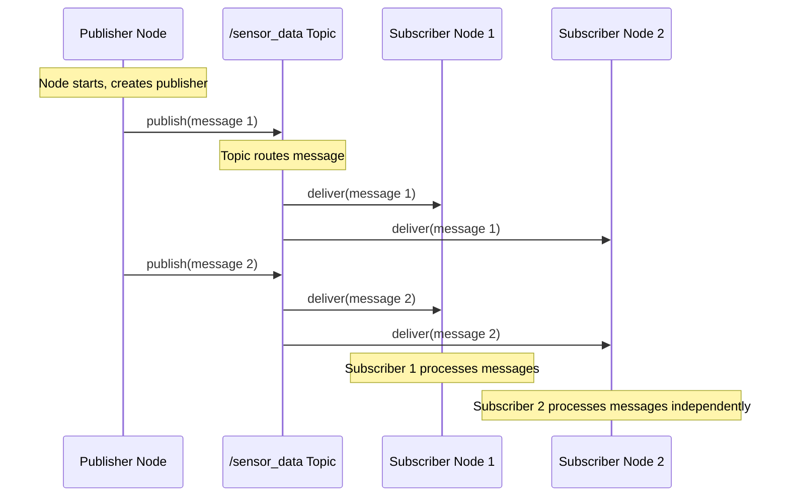
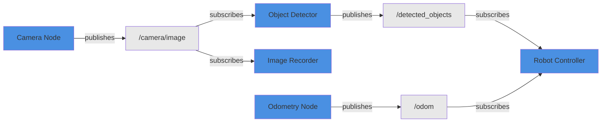

# Topics and Publishers

## Learning Objectives

By the end of this chapter, you will be able to:

- Explain the publish-subscribe pattern and why it enables decoupled robotics systems
- Create ROS 2 publishers that send messages on named topics at configurable rates
- Create ROS 2 subscribers that receive and process messages from topics
- Identify appropriate message types for different robotics data (sensors, commands, diagnostics)
- Apply basic Quality of Service (QoS) settings to control message delivery reliability

## Introduction

Imagine you're listening to your favorite radio station. The broadcaster transmits on 101.5 FM without knowing who's listening—it could be one car, a thousand homes, or nobody at all. Meanwhile, multiple listeners tune in simultaneously without interfering with each other. This one-to-many broadcast pattern, where producers and consumers are completely decoupled, is exactly how ROS 2 topics work.

In robotics, this decoupling is essential. A camera node publishes images without knowing whether one, five, or zero nodes are processing them. A navigation planner subscribes to laser scan data without caring whether it comes from a real sensor or a simulator. This flexibility lets you swap components, add new nodes, and build modular systems that scale from simple prototypes to production robots.

In this chapter, you'll master ROS 2's publish-subscribe communication. You'll create publishers that broadcast sensor data, subscribers that process incoming messages, and multi-node systems that demonstrate real inter-process communication. You'll learn about message types (the data structures flowing through your robot) and Quality of Service policies (reliability guarantees for critical data). By the end, you'll build a complete talker-listener system—the foundation for every multi-node robot application.

Before diving in, make sure you've completed Chapters 1 and 2. You should be comfortable creating ROS 2 nodes, using logging, and working with parameters. We'll build directly on those skills.

## Core Concepts

### The Publish-Subscribe Pattern

Think of a newspaper delivery system. Publishers print newspapers and leave them at distribution points (topics). Subscribers pick up copies from those distribution points. Publishers don't mail directly to subscribers—they publish to an intermediary location. This decoupling means publishers can print without knowing subscriber addresses, and subscribers can join or leave without notifying publishers.

The **publish-subscribe pattern** (often shortened to "pub/sub") is a messaging paradigm where senders (publishers) and receivers (subscribers) communicate indirectly through named channels (topics). Publishers broadcast messages to topics without knowledge of subscribers. Subscribers express interest in topics without knowledge of publishers. The middleware (DDS in ROS 2's case) handles discovery and message routing automatically.

This pattern has powerful properties for robotics:

1. **Decoupling**: Publishers and subscribers don't depend on each other's existence, timing, or implementation
2. **Scalability**: Add new subscribers without modifying publishers; add backup publishers without changing subscribers
3. **Flexibility**: Swap real sensors for simulated ones by publishing to the same topic
4. **Fault tolerance**: If one subscriber crashes, publishers and other subscribers continue unaffected

Here's how it works in ROS 2:



**Figure 1: Publish-Subscribe Message Flow**

Notice that Publisher Node sends one message, but both subscribers receive it independently. The publisher doesn't know Subscriber Node 2 exists. If Subscriber Node 1 crashes, messages still reach Subscriber Node 2. This loose coupling is pub/sub's core strength.

### Topics: Named Message Channels

Continuing the radio analogy, if the pub/sub pattern is broadcasting, **topics** are the specific frequencies. Just as radio stations broadcast on distinct frequencies (101.5 FM vs 98.3 FM), ROS 2 nodes communicate via distinct topics (`/camera/image` vs `/cmd_vel`).

A **topic** is a named bus over which nodes exchange typed messages. Topics have three key attributes:

1. **Name**: A string identifier like `/camera/image`, `/odom`, `/scan`. By convention, topic names use forward slashes to indicate hierarchy (like file paths) and lowercase with underscores.

2. **Message Type**: The data structure of messages on this topic, like `sensor_msgs/Image` for camera images or `std_msgs/String` for text. All messages on a topic must have the same type—you can't mix strings and images on one topic.

3. **QoS Policy**: Quality of Service settings controlling reliability, history depth, durability, and latency. We'll cover QoS in detail later this chapter.

Topics support many-to-many communication:
- **Multiple publishers** can send to the same topic (e.g., two cameras publishing to `/camera/image`)
- **Multiple subscribers** can receive from the same topic (e.g., object detection and image recording both subscribing to `/camera/image`)
- **Zero subscribers** is valid—publisher keeps broadcasting, messages are discarded (like radio station broadcasting to an empty room)
- **Zero publishers** is valid—subscribers wait for messages that may never arrive

Here's a typical multi-node topic graph:



**Figure 2: Multi-Node Topic Communication Graph**

Blue boxes are nodes (publishers and/or subscribers), gray boxes are topics. Notice how Robot Controller subscribes to two topics, combining object detection results and odometry data. The Camera Node doesn't know Object Detector and Image Recorder exist—it just publishes images.

### Message Types: Data Structures

If topics are roads, **messages** are the vehicles traveling on them. A message is a data structure—like a Python class or C struct—that defines what information is transmitted.

ROS 2 provides hundreds of standard message types in packages like:

- **std_msgs**: Basic types (String, Int32, Float64, Bool, Header)
- **sensor_msgs**: Sensor data (Image, LaserScan, PointCloud2, Imu, NavSatFix)
- **geometry_msgs**: Geometric primitives (Point, Pose, Twist, Transform)
- **nav_msgs**: Navigation data (Odometry, Path, GridMap)

For example, `geometry_msgs/Twist` (used for velocity commands to mobile robots) contains:

```
geometry_msgs/Vector3 linear
  float64 x  # Forward/backward velocity (m/s)
  float64 y  # Left/right velocity (m/s)
  float64 z  # Up/down velocity (m/s)
geometry_msgs/Vector3 angular
  float64 x  # Roll rate (rad/s)
  float64 y  # Pitch rate (rad/s)
  float64 z  # Yaw rate (rad/s)
```

When you create a publisher, you specify the message type:

```python
from std_msgs.msg import String

# Publisher for String messages on /chatter topic
self.publisher_ = self.create_publisher(String, 'chatter', 10)
```

When you send a message, you instantiate the message type and populate its fields:

```python
msg = String()
msg.data = 'Hello, ROS 2!'
self.publisher_.publish(msg)
```

Message types enforce contracts between nodes. If Publisher Node sends `sensor_msgs/Image` but Subscriber Node expects `std_msgs/String`, ROS 2 won't deliver the message—type mismatch prevents errors. This compile-time-like checking at runtime catches bugs early.

You can inspect message types from the command line:

```bash
# Show all message types in a package
ros2 interface list | grep std_msgs

# Show message structure
ros2 interface show std_msgs/msg/String
```

For most robotics applications, standard message types cover your needs. Chapter 6 will teach you to create custom message types for domain-specific data.

### Publishers: Broadcasting Messages

A **publisher** is a node component that sends messages to a topic. Think of it as a radio transmitter tuned to a specific frequency, periodically broadcasting weather updates. The transmitter doesn't check if anyone's listening—it just broadcasts.

Creating a publisher in rclpy involves three steps:

1. **Create publisher object** in node constructor:
   ```python
   from std_msgs.msg import String

   self.publisher_ = self.create_publisher(String, 'topic_name', 10)
   ```

   Parameters:
   - Message type (`String`)
   - Topic name (`'topic_name'`)
   - Queue size (`10`): How many messages to buffer if subscribers can't keep up

2. **Create message instance** when ready to send:
   ```python
   msg = String()
   msg.data = 'Hello from publisher!'
   ```

3. **Publish message** to the topic:
   ```python
   self.publisher_.publish(msg)
   ```

Publishers typically use timers to send messages periodically:

```python
class MinimalPublisher(Node):
    def __init__(self):
        super().__init__('minimal_publisher')

        # Create publisher: String messages on /chatter, queue size 10
        self.publisher_ = self.create_publisher(String, 'chatter', 10)

        # Create timer: call timer_callback every 1.0 seconds
        self.timer = self.create_timer(1.0, self.timer_callback)

        self.counter = 0

    def timer_callback(self):
        """Called every 1 second to publish a message."""
        msg = String()
        msg.data = f'Hello World: {self.counter}'

        self.publisher_.publish(msg)
        self.get_logger().info(f'Publishing: "{msg.data}"')

        self.counter += 1
```

This pattern—timer triggering periodic publishing—is ubiquitous in robotics. Sensors publish at their native rates (cameras at 30 Hz, lidar at 10 Hz, GPS at 1 Hz). The timer ensures consistent timing without blocking the node.

### Subscribers: Receiving Messages

A **subscriber** is a node component that receives messages from a topic. Think of it as a radio receiver tuned to a frequency, processing weather updates as they arrive. The receiver doesn't know who's transmitting—it just listens and reacts.

Creating a subscriber in rclpy involves two steps:

1. **Create subscription object** in node constructor with callback function:
   ```python
   from std_msgs.msg import String

   self.subscription = self.create_subscription(
       String,              # Message type
       'topic_name',        # Topic name
       self.listener_callback,  # Callback function
       10                   # Queue size
   )
   ```

2. **Define callback function** to process incoming messages:
   ```python
   def listener_callback(self, msg):
       """Called automatically when message arrives."""
       self.get_logger().info(f'I heard: "{msg.data}"')
   ```

The callback function is invoked automatically by rclpy's executor whenever a message arrives on the subscribed topic. This event-driven pattern means your node doesn't poll or wait—it reacts instantly when data becomes available.

Here's a complete subscriber node:

```python
class MinimalSubscriber(Node):
    def __init__(self):
        super().__init__('minimal_subscriber')

        # Create subscription: String messages from /chatter
        self.subscription = self.create_subscription(
            String,
            'chatter',
            self.listener_callback,
            10
        )

        # Prevent unused variable warning
        self.subscription

    def listener_callback(self, msg):
        """Process incoming String message."""
        self.get_logger().info(f'I heard: "{msg.data}"')
```

When you run this subscriber alongside the publisher from the previous section, you'll see messages flow:

**Terminal 1 (publisher)**:
```
[INFO] [1701234567.123] [minimal_publisher]: Publishing: "Hello World: 0"
[INFO] [1701234568.123] [minimal_publisher]: Publishing: "Hello World: 1"
```

**Terminal 2 (subscriber)**:
```
[INFO] [1701234567.123] [minimal_subscriber]: I heard: "Hello World: 0"
[INFO] [1701234568.123] [minimal_subscriber]: I heard: "Hello World: 1"
```

This talker-listener pattern is the "Hello World" of ROS 2 multi-node communication. Every complex robot system builds on this foundation.

### Quality of Service: Reliability Guarantees

Imagine sending a text message versus making a phone call. Text messages are "best effort"—they might arrive instantly or take minutes, and you don't get confirmation of receipt. Phone calls are "reliable"—if the connection drops, you know immediately and can reconnect. ROS 2's Quality of Service (QoS) policies let you choose similar trade-offs for robot messages.

**Quality of Service (QoS)** policies define reliability, durability, and latency characteristics for topic communication. While default QoS settings work for most cases, understanding QoS is crucial for production robots where some data is critical (motor commands must be reliable) while other data is expendable (one dropped camera frame among 30 per second is acceptable).

Key QoS policies:

1. **Reliability**:
   - **Reliable**: Guarantee message delivery, resend if lost (like TCP). Use for critical commands.
   - **Best Effort**: Send once, no resend if lost (like UDP). Use for high-frequency sensor data.

2. **Durability**:
   - **Transient Local**: New subscribers receive last N messages published before they joined. Use for status updates.
   - **Volatile**: New subscribers only receive messages published after they join. Use for real-time data.

3. **History**:
   - **Keep Last N**: Buffer last N messages (queue size). Use when recent data matters.
   - **Keep All**: Buffer all undelivered messages (risky—unbounded memory). Rarely used.

4. **Deadline**: Maximum time between messages. If exceeded, app is notified.

5. **Lifespan**: Maximum time a message is valid. Old messages discarded.

Here's how QoS affects communication:

```python
from rclpy.qos import QoSProfile, ReliabilityPolicy, DurabilityPolicy, HistoryPolicy

# Custom QoS: Reliable, transient local, keep last 10 messages
qos_profile = QoSProfile(
    reliability=ReliabilityPolicy.RELIABLE,
    durability=DurabilityPolicy.TRANSIENT_LOCAL,
    history=HistoryPolicy.KEEP_LAST,
    depth=10
)

# Publisher with custom QoS
self.publisher_ = self.create_publisher(String, 'critical_topic', qos_profile)

# Subscriber with matching QoS
self.subscription = self.create_subscription(
    String,
    'critical_topic',
    self.callback,
    qos_profile
)
```

**Important**: Publishers and subscribers must have compatible QoS policies. Mismatched QoS (e.g., publisher using Reliable, subscriber using Best Effort) often prevents communication. When in doubt, use default QoS (queue size 10) for beginners.

Common QoS patterns:

- **Sensor data** (camera, lidar): Best Effort, Volatile, Keep Last 1 (high-frequency, drop old frames)
- **Commands** (motor control): Reliable, Volatile, Keep Last 10 (critical, recent commands matter)
- **Status** (battery level): Reliable, Transient Local, Keep Last 1 (new nodes need latest status)

We'll cover advanced QoS configuration in Chapter 5. For now, default QoS settings (queue size 10) work well for learning.

## Practical Examples

### Example 1: Simple String Publisher

**Objective**: Create a publisher node that broadcasts string messages at 1 Hz, demonstrating timer-based publishing and basic message creation.

**Prerequisites**:
- ROS 2 Humble installed and sourced
- Completed Chapters 1-2 (understand nodes, logging, timers)

#### Code

```python
#!/usr/bin/env python3
"""
Simple publisher node demonstrating timer-based message publishing.
Publishes string messages to /chatter topic at 1 Hz.
"""
import rclpy
from rclpy.node import Node
from std_msgs.msg import String


class SimplePublisher(Node):
    """
    Publishes string messages periodically to demonstrate pub/sub.
    The quintessential ROS 2 "talker" node.
    """

    def __init__(self):
        # Initialize node with descriptive name
        super().__init__('simple_publisher')

        # Create publisher: String messages on /chatter topic, queue size 10
        # Queue size 10 means buffer up to 10 messages if subscribers lag
        self.publisher_ = self.create_publisher(String, 'chatter', 10)

        # Create timer: call timer_callback every 1.0 seconds (1 Hz)
        # This pattern ensures consistent publishing rate
        timer_period = 1.0  # seconds
        self.timer = self.create_timer(timer_period, self.timer_callback)

        # Message counter for demonstration
        self.counter = 0

        self.get_logger().info('Simple publisher initialized, publishing at 1 Hz')

    def timer_callback(self):
        """
        Timer callback: called every 1.0 seconds to publish a message.
        Creates String message, populates data, publishes to topic.
        """
        # Create message instance
        msg = String()

        # Populate message data field
        msg.data = f'Hello World: {self.counter}'

        # Publish message to /chatter topic
        self.publisher_.publish(msg)

        # Log what we published (helps verify operation)
        self.get_logger().info(f'Publishing: "{msg.data}"')

        # Increment counter for next message
        self.counter += 1


def main(args=None):
    # Initialize ROS 2 Python client library
    rclpy.init(args=args)

    # Create simple publisher node
    node = SimplePublisher()

    # Keep node running, processing timer callbacks
    try:
        rclpy.spin(node)
    except KeyboardInterrupt:
        node.get_logger().info('Keyboard interrupt, shutting down')
    finally:
        # Cleanup
        node.destroy_node()
        rclpy.shutdown()


if __name__ == '__main__':
    main()
```

#### How to Run

```bash
# Step 1: Source ROS 2 environment
source /opt/ros/humble/setup.bash

# Step 2: Save code to file
nano simple_publisher.py
# Paste code, Ctrl+X, Y, Enter to save

# Step 3: Run the publisher
python3 simple_publisher.py

# Step 4: In a second terminal, verify topic exists
source /opt/ros/humble/setup.bash
ros2 topic list

# Step 5: See messages being published
ros2 topic echo /chatter

# Step 6: Check publishing rate (should be ~1 Hz)
ros2 topic hz /chatter
```

#### Expected Output

**Terminal 1 (publisher node)**:
```
[INFO] [1701234567.123456789] [simple_publisher]: Simple publisher initialized, publishing at 1 Hz
[INFO] [1701234567.123456790] [simple_publisher]: Publishing: "Hello World: 0"
[INFO] [1701234568.123456789] [simple_publisher]: Publishing: "Hello World: 1"
[INFO] [1701234569.123456789] [simple_publisher]: Publishing: "Hello World: 2"
[INFO] [1701234570.123456789] [simple_publisher]: Publishing: "Hello World: 3"
```

**Terminal 2 (`ros2 topic echo /chatter`)**:
```
data: 'Hello World: 0'
---
data: 'Hello World: 1'
---
data: 'Hello World: 2'
---
```

**Terminal 3 (`ros2 topic hz /chatter`)**:
```
average rate: 1.000
    min: 1.000s max: 1.000s std dev: 0.00000s window: 10
```

#### Explanation

This example demonstrates the fundamental publisher pattern in ROS 2. The `create_publisher()` method creates a publisher object that sends `String` messages to the `/chatter` topic with a queue size of 10 (buffering up to 10 messages if subscribers can't keep up). The timer ensures messages are published at a consistent 1 Hz rate—critical for robotics where timing matters.

Notice we create the message inside the callback, populate its fields (`msg.data`), then call `publish()`. The publisher sends the message to any subscribers currently listening to `/chatter`. If no subscribers exist, the message is discarded (like broadcasting to an empty room). The logging helps verify operation during development, but you'd typically reduce verbosity in production.

**Key Takeaway**: Use `create_publisher()` with a message type and topic name, then publish messages periodically with a timer.

---

### Example 2: Simple String Subscriber

**Objective**: Create a subscriber node that receives string messages from `/chatter` topic, demonstrating callback-based message processing.

**Prerequisites**:
- Example 1 completed and understood
- Understanding of Python callback functions

#### Code

```python
#!/usr/bin/env python3
"""
Simple subscriber node demonstrating callback-based message reception.
Subscribes to /chatter topic and processes incoming String messages.
"""
import rclpy
from rclpy.node import Node
from std_msgs.msg import String


class SimpleSubscriber(Node):
    """
    Subscribes to string messages and logs them.
    The quintessential ROS 2 "listener" node.
    """

    def __init__(self):
        # Initialize node with descriptive name
        super().__init__('simple_subscriber')

        # Create subscription: String messages from /chatter topic
        # Callback listener_callback is invoked for each incoming message
        # Queue size 10 buffers messages if processing is slow
        self.subscription = self.create_subscription(
            String,                    # Message type
            'chatter',                 # Topic name
            self.listener_callback,    # Callback function
            10                         # Queue size
        )

        # Prevent unused variable warning (subscription must be stored)
        # Python linter complains if we create object without saving reference
        self.subscription

        # Track message count for demonstration
        self.message_count = 0

        self.get_logger().info('Simple subscriber initialized, listening to /chatter')

    def listener_callback(self, msg):
        """
        Callback function: automatically invoked when message arrives.
        Parameter 'msg' is the received String message.
        """
        # Increment message counter
        self.message_count += 1

        # Extract string data from message
        received_data = msg.data

        # Log received message
        self.get_logger().info(f'I heard: "{received_data}" (message #{self.message_count})')


def main(args=None):
    # Initialize ROS 2 Python client library
    rclpy.init(args=args)

    # Create simple subscriber node
    node = SimpleSubscriber()

    # Keep node running, processing incoming messages
    # Callbacks are invoked automatically by spin()
    try:
        rclpy.spin(node)
    except KeyboardInterrupt:
        node.get_logger().info('Keyboard interrupt, shutting down')
    finally:
        # Cleanup
        node.destroy_node()
        rclpy.shutdown()


if __name__ == '__main__':
    main()
```

#### How to Run

```bash
# Step 1: Source ROS 2 environment
source /opt/ros/humble/setup.bash

# Step 2: Save code to file
nano simple_subscriber.py
# Paste code, Ctrl+X, Y, Enter to save

# Step 3: In one terminal, run the publisher from Example 1
python3 simple_publisher.py

# Step 4: In a second terminal, run the subscriber
source /opt/ros/humble/setup.bash
python3 simple_subscriber.py

# Step 5: Observe messages flowing from publisher to subscriber
# Both terminals will show synchronized activity

# Step 6: (Optional) Run multiple subscribers simultaneously
# Terminal 3:
source /opt/ros/humble/setup.bash
python3 simple_subscriber.py
# Both subscribers receive all messages independently
```

#### Expected Output

**Terminal 1 (publisher from Example 1)**:
```
[INFO] [1701234567.123456789] [simple_publisher]: Publishing: "Hello World: 0"
[INFO] [1701234568.123456789] [simple_publisher]: Publishing: "Hello World: 1"
[INFO] [1701234569.123456789] [simple_publisher]: Publishing: "Hello World: 2"
```

**Terminal 2 (subscriber)**:
```
[INFO] [1701234567.123456790] [simple_subscriber]: Simple subscriber initialized, listening to /chatter
[INFO] [1701234567.123456791] [simple_subscriber]: I heard: "Hello World: 0" (message #1)
[INFO] [1701234568.123456791] [simple_subscriber]: I heard: "Hello World: 1" (message #2)
[INFO] [1701234569.123456791] [simple_subscriber]: I heard: "Hello World: 2" (message #3)
```

Notice timestamps show messages arrive almost instantly after publication (sub-millisecond latency on localhost).

#### Explanation

This example demonstrates callback-based subscription in ROS 2. The `create_subscription()` method registers interest in the `/chatter` topic. When messages arrive, rclpy's executor automatically invokes `listener_callback()` with the message as a parameter. This event-driven pattern means your code reacts instantly to data without polling or blocking.

The callback function extracts data from the message (`msg.data` for String messages) and processes it—in this case, just logging. Real subscribers would do computation: image processing, sensor fusion, decision-making, etc. The key insight is that subscribers are reactive: they don't ask "is there new data?", they're told "here's new data" and respond immediately.

You can run multiple subscribers to the same topic—each receives all messages independently. This enables patterns like one subscriber logging data while another processes it in real-time.

**Key Takeaway**: Use `create_subscription()` with a message type, topic name, and callback function to process messages as they arrive.

---

### Example 3: Combined Publisher-Subscriber Node

**Objective**: Create a single node that both publishes and subscribes, demonstrating bidirectional communication and message transformation.

**Prerequisites**:
- Examples 1 and 2 completed
- Understanding of message processing patterns

#### Code

```python
#!/usr/bin/env python3
"""
Combined publisher-subscriber node demonstrating message transformation.
Subscribes to /input_topic, processes messages, publishes to /output_topic.
"""
import rclpy
from rclpy.node import Node
from std_msgs.msg import String


class ProcessorNode(Node):
    """
    Node that subscribes to input, transforms messages, and publishes output.
    Common pattern for sensor processing, data transformation, filtering.
    """

    def __init__(self):
        # Initialize node with descriptive name
        super().__init__('processor_node')

        # Create publisher: transformed messages on /output_topic
        self.publisher_ = self.create_publisher(String, 'output_topic', 10)

        # Create subscription: raw messages from /input_topic
        self.subscription = self.create_subscription(
            String,
            'input_topic',
            self.input_callback,
            10
        )
        self.subscription

        # Track processed message count
        self.processed_count = 0

        self.get_logger().info('Processor node initialized')
        self.get_logger().info('  Subscribing to: /input_topic')
        self.get_logger().info('  Publishing to: /output_topic')

    def input_callback(self, msg):
        """
        Process incoming message and publish transformed result.
        Demonstrates the subscribe-process-publish pattern.
        """
        # Extract input data
        input_data = msg.data

        # Process message: convert to uppercase (example transformation)
        # In real systems: image filtering, coordinate transforms, etc.
        processed_data = input_data.upper()

        # Create output message
        output_msg = String()
        output_msg.data = f'PROCESSED: {processed_data}'

        # Publish transformed message
        self.publisher_.publish(output_msg)

        # Log transformation for visibility
        self.processed_count += 1
        self.get_logger().info(
            f'Transformed "{input_data}" -> "{output_msg.data}" '
            f'(#{self.processed_count})'
        )


def main(args=None):
    # Initialize ROS 2 Python client library
    rclpy.init(args=args)

    # Create processor node (both publisher and subscriber)
    node = ProcessorNode()

    # Keep node running, processing callbacks
    try:
        rclpy.spin(node)
    except KeyboardInterrupt:
        node.get_logger().info('Keyboard interrupt, shutting down')
    finally:
        # Cleanup
        node.destroy_node()
        rclpy.shutdown()


if __name__ == '__main__':
    main()
```

#### How to Run

```bash
# Step 1: Source ROS 2 environment
source /opt/ros/humble/setup.bash

# Step 2: Save code to file
nano processor_node.py
# Paste code, Ctrl+X, Y, Enter to save

# Step 3: Run processor node in Terminal 1
python3 processor_node.py

# Step 4: In Terminal 2, publish test messages manually
source /opt/ros/humble/setup.bash
ros2 topic pub /input_topic std_msgs/msg/String "{data: 'hello ros2'}" --once
ros2 topic pub /input_topic std_msgs/msg/String "{data: 'robotics is awesome'}" --once

# Step 5: In Terminal 3, subscribe to output to see transformed messages
source /opt/ros/humble/setup.bash
ros2 topic echo /output_topic

# Step 6: Verify topic connections with graph
ros2 node info /processor_node
```

#### Expected Output

**Terminal 1 (processor node)**:
```
[INFO] [1701234567.123456789] [processor_node]: Processor node initialized
[INFO] [1701234567.123456790] [processor_node]:   Subscribing to: /input_topic
[INFO] [1701234567.123456791] [processor_node]:   Publishing to: /output_topic
[INFO] [1701234570.123456789] [processor_node]: Transformed "hello ros2" -> "PROCESSED: HELLO ROS2" (#1)
[INFO] [1701234575.123456789] [processor_node]: Transformed "robotics is awesome" -> "PROCESSED: ROBOTICS IS AWESOME" (#2)
```

**Terminal 3 (`ros2 topic echo /output_topic`)**:
```
data: 'PROCESSED: HELLO ROS2'
---
data: 'PROCESSED: ROBOTICS IS AWESOME'
---
```

#### Explanation

This example demonstrates a common robotics pattern: subscribe to raw data, process it, and publish results. The node acts as a pipeline stage, transforming input messages to output messages. This pattern appears everywhere: image nodes subscribe to raw camera data and publish filtered images; navigation nodes subscribe to laser scans and publish obstacle maps; AI nodes subscribe to sensor fusion data and publish control commands.

The key insight is that nodes can be both producers and consumers simultaneously. The subscription callback (`input_callback`) processes incoming data and immediately publishes transformed results. This reactive, event-driven pattern enables real-time processing—as soon as input arrives, output is generated and published.

In production systems, you'd replace the uppercase transformation with actual processing: computer vision algorithms, Kalman filtering, motion planning, etc. The structure remains the same: subscribe, process, publish.

**Key Takeaway**: Combine publishers and subscribers in one node to create processing pipelines that transform data streams.

## Hands-on Exercise

### Exercise 1: High-Frequency Talker-Listener System

**Difficulty**: Intermediate

**Objective**: Modify the simple publisher from Example 1 to send messages at 10 Hz instead of 1 Hz, create a matching subscriber, and verify the publishing rate using ROS 2 tools.

**Estimated Time**: 20-25 minutes

**Instructions**:
1. Copy `simple_publisher.py` from Example 1 to a new file named `fast_publisher.py`
2. Change the node name from `'simple_publisher'` to `'fast_publisher'`
3. Modify the timer period from `1.0` seconds to `0.1` seconds (10 Hz = 1/10 second per message)
4. Update the log message to indicate "publishing at 10 Hz"
5. Copy `simple_subscriber.py` from Example 2 to `fast_subscriber.py`
6. Change the node name from `'simple_subscriber'` to `'fast_subscriber'`
7. Run the fast publisher in one terminal
8. Run the fast subscriber in a second terminal
9. In a third terminal, verify the publishing rate with `ros2 topic hz /chatter` (should show ~10 Hz)
10. Use `ros2 topic bw /chatter` to check bandwidth usage
11. Stop both nodes with Ctrl+C and verify graceful shutdown

**Success Criteria**:
- [ ] Fast publisher node publishes messages at approximately 10 Hz (verified with `ros2 topic hz`)
- [ ] Fast subscriber receives all messages without noticeable lag
- [ ] Node names appear as `fast_publisher` and `fast_subscriber` in `ros2 node list`
- [ ] Logs show 10 messages per second in publisher terminal
- [ ] Both nodes shut down gracefully with Ctrl+C (no errors in cleanup)

**Hints** (click to expand):

<details>
<summary>Hint 1: Converting frequency to timer period</summary>

Timer period is the inverse of frequency:
- 1 Hz = 1.0 second period
- 10 Hz = 0.1 second period (1 / 10)
- 100 Hz = 0.01 second period (1 / 100)

Change `timer_period = 1.0` to `timer_period = 0.1` in your publisher.
</details>

<details>
<summary>Hint 2: Verifying publishing rate</summary>

Use ROS 2 CLI tools to verify:
```bash
# Check publishing frequency (should show ~10 Hz)
ros2 topic hz /chatter

# Check bandwidth (bytes per second)
ros2 topic bw /chatter

# See real-time message flow
ros2 topic echo /chatter
```
</details>

<details>
<summary>Hint 3: Observing high-frequency output</summary>

At 10 Hz, logs scroll quickly. To make them readable:
- Reduce logging verbosity by removing or commenting out the `self.get_logger().info()` line in the timer callback
- Or, only log every Nth message:
  ```python
  if self.counter % 10 == 0:  # Log every 10th message
      self.get_logger().info(f'Publishing: "{msg.data}"')
  ```
</details>

<details>
<summary>Hint 4: Understanding rate vs period</summary>

Remember:
- **Rate** (Hz) = how many times per second
- **Period** (seconds) = time between events
- **Formula**: period = 1 / rate

For 10 Hz: period = 1 / 10 = 0.1 seconds
</details>

**Extension Challenge** (optional):
- Add a parameter `publish_rate_hz` (default: 10.0) to the publisher. Use this parameter to calculate the timer period dynamically: `timer_period = 1.0 / publish_rate_hz`. This lets users override the rate from the command line: `python3 fast_publisher.py --ros-args -p publish_rate_hz:=20.0` for 20 Hz publishing. Test with different rates (1 Hz, 50 Hz, 100 Hz) and observe performance limits on your system.

## Common Pitfalls

### Pitfall 1: Topic Name Typos and Case Sensitivity

**What happens**: Your publisher sends messages, subscriber runs without errors, but no messages are received. Running `ros2 topic list` shows both `/chatter` and `/Chatter` (or `/chater` with a typo).

**Why it happens**: ROS 2 topic names are case-sensitive and must match exactly between publishers and subscribers. A publisher sending to `/camera_data` won't communicate with a subscriber listening to `/Camera_Data` or `/camera_daat`. ROS 2 treats these as three different topics. The middleware doesn't warn about potential typos—it assumes you want separate topics.

**How to fix it**:
1. Check topic names in both publisher and subscriber code
2. Use `ros2 topic list` to see all active topics
3. Ensure exact match including case, underscores, and spelling
4. Example debugging:
   ```bash
   # See all topics
   ros2 topic list

   # If you see /chatter and /Chatter, you have a case mismatch
   # Check publisher topic:
   ros2 topic info /chatter

   # Check subscriber topic:
   ros2 topic info /Chatter

   # Fix: Make both use lowercase /chatter
   ```

**How to avoid it**:
- Use **lowercase with underscores** for all topic names (ROS 2 convention)
- Define topic names as constants at the top of your file:
  ```python
  TOPIC_NAME = 'chatter'

  # In publisher:
  self.publisher_ = self.create_publisher(String, TOPIC_NAME, 10)

  # In subscriber:
  self.subscription = self.create_subscription(String, TOPIC_NAME, self.callback, 10)
  ```
- Copy-paste topic names between publisher and subscriber code instead of retyping
- Use `ros2 topic echo /topic_name` to verify a topic exists before subscribing

**Related symptoms**:
- Publisher shows messages being sent, subscriber receives nothing
- `ros2 topic list` shows duplicate topics with different capitalization
- `ros2 topic info /topic_name` shows publisher but no subscribers (or vice versa)

---

### Pitfall 2: QoS Policy Mismatch

**What happens**: Publisher and subscriber are running, topic names match, but messages aren't delivered. You might see warnings like:

```
[WARN] [rclpy]: New publisher discovered on topic '/topic', offering incompatible QoS
```

Or subscribers simply receive no messages despite publishers sending them.

**Why it happens**: Publishers and subscribers must have compatible Quality of Service policies. Common mismatches:
- Publisher uses `RELIABLE`, subscriber uses `BEST_EFFORT`
- Publisher uses `TRANSIENT_LOCAL`, subscriber uses `VOLATILE`
- Different history depths or deadline settings

ROS 2's middleware enforces QoS compatibility. If policies don't match, nodes might discover each other but refuse to communicate.

**How to fix it**:
1. Check if you're using custom QoS in publisher or subscriber
2. Match QoS policies exactly between publisher and subscriber:
   ```python
   from rclpy.qos import QoSProfile, ReliabilityPolicy, DurabilityPolicy

   # Define consistent QoS
   qos_profile = QoSProfile(
       reliability=ReliabilityPolicy.RELIABLE,
       durability=DurabilityPolicy.VOLATILE,
       depth=10
   )

   # Use same QoS for both
   self.publisher_ = self.create_publisher(String, 'topic', qos_profile)
   self.subscription = self.create_subscription(String, 'topic', self.callback, qos_profile)
   ```
3. Or, use default QoS for both (just pass integer queue size):
   ```python
   self.publisher_ = self.create_publisher(String, 'topic', 10)
   self.subscription = self.create_subscription(String, 'topic', self.callback, 10)
   ```

**How to avoid it**:
- For beginners: **always use default QoS** (integer queue size like `10`)
- For advanced users: define QoS profiles in a shared config file and import them
- Check QoS compatibility with:
  ```bash
  ros2 topic info /topic_name --verbose
  ```
  This shows publisher and subscriber QoS policies—they should match.

**Related warnings**:
```
[WARN] [rclpy]: New subscription discovered on topic 'X', requesting incompatible QoS
[WARN] [rmw_fastrtps_cpp]: Subscriber on topic 'X' has incompatible QoS
```

---

### Pitfall 3: Blocking Callbacks with Heavy Computation

**What happens**: Your subscriber callback does heavy computation (image processing, machine learning inference, complex calculations). Messages queue up, subscriber lags behind publisher, and eventually messages are dropped. Latency increases and system becomes unresponsive.

**Why it happens**: Subscriber callbacks run on rclpy's executor thread. If your callback takes 100ms to process one message but messages arrive every 10ms (100 Hz publisher), you can't keep up. The callback blocks the executor, preventing other callbacks (timers, other subscriptions) from running. Messages accumulate in the queue until it's full, then new messages are dropped.

**How to fix it**:
1. **Option A: Reduce computation in callback** (preferred for simple cases):
   - Move expensive work outside the callback
   - Only extract data in callback, process in separate thread
   ```python
   import threading

   def listener_callback(self, msg):
       # Extract data quickly (non-blocking)
       data = msg.data

       # Process in background thread (doesn't block executor)
       thread = threading.Thread(target=self.process_data, args=(data,))
       thread.start()

   def process_data(self, data):
       # Heavy computation here (runs in separate thread)
       result = expensive_processing(data)
       self.get_logger().info(f'Processing complete: {result}')
   ```

2. **Option B: Use MultiThreadedExecutor** (for concurrent callbacks):
   ```python
   from rclpy.executors import MultiThreadedExecutor

   # In main():
   executor = MultiThreadedExecutor(num_threads=4)
   executor.add_node(node)
   executor.spin()
   ```

3. **Option C: Reduce publishing rate** (if feasible):
   - Slow down publisher to match subscriber's processing capacity
   - Use parameters to configure rate dynamically

**How to avoid it**:
- **Guideline**: Callbacks should complete in less then 1ms for high-frequency topics
- Profile callback duration with timing:
  ```python
  import time

  def listener_callback(self, msg):
      start = time.time()
      # Process message
      self.process(msg)
      duration = time.time() - start
      if duration > 0.01:  # Warn if >10ms
          self.get_logger().warn(f'Slow callback: {duration*1000:.1f}ms')
  ```
- Keep callbacks lightweight: extract data, validate, queue for processing elsewhere
- Never call blocking functions in callbacks: `time.sleep()`, network I/O, disk I/O

**Related symptoms**:
- Increasing latency between publish and subscribe
- `ros2 topic hz` shows lower receive rate than publish rate
- Warning messages about dropped messages or queue overflows
- Other callbacks (timers) not firing on schedule

## Summary

In this chapter, you mastered ROS 2's publish-subscribe communication—the foundation of all multi-node robotics systems.

Key takeaways:

- **Publish-subscribe pattern enables decoupling**: Publishers broadcast messages to topics without knowing subscribers exist; subscribers receive messages without knowing publishers exist. This loose coupling allows flexible, modular robot architectures.
- **Topics are named message channels**: Topics have names (`/camera/image`), types (`sensor_msgs/Image`), and QoS policies (reliability, durability). Multiple publishers and subscribers can share a topic in many-to-many communication.
- **Message types define data structures**: ROS 2 provides hundreds of standard message types for sensors, commands, and diagnostics. Type matching between publishers and subscribers prevents errors.
- **Publishers broadcast messages**: Use `create_publisher()` with message type and topic name, then periodically publish messages with timers. Queue size buffers messages if subscribers lag.
- **Subscribers receive messages via callbacks**: Use `create_subscription()` with callback function that's invoked automatically when messages arrive. This event-driven pattern enables reactive, real-time processing.
- **Quality of Service policies control reliability**: QoS settings (Reliable vs Best Effort, Transient Local vs Volatile) determine message delivery guarantees. Publishers and subscribers must have compatible QoS to communicate.

You created complete publisher and subscriber nodes, built a message transformation pipeline, and developed a high-frequency talker-listener system. You also learned to avoid common pitfalls: topic name typos, QoS mismatches, and blocking callbacks that can cripple system performance.

These skills complete the foundational ROS 2 learning path. You now understand nodes (Chapter 2), logging and parameters (Chapter 2), and topics with publishers and subscribers (this chapter). You can build multi-node systems where independent processes communicate to achieve complex robotic behaviors.

In the next chapter, you'll learn about services—ROS 2's request-response communication pattern for synchronous interactions like "get current battery level" or "plan path to goal pose." Services complement topics by enabling two-way communication with guaranteed responses.

## Further Reading

- **[ROS 2 Topics Tutorial](https://docs.ros.org/en/humble/Tutorials/Beginner-CLI-Tools/Understanding-ROS2-Topics/Understanding-ROS2-Topics.html)** - Official ROS 2 tutorial covering topics, publishers, subscribers, and CLI tools for topic introspection
- **[ROS 2 Message Types Reference](https://docs.ros.org/en/humble/p/std_msgs/)** - Complete documentation of standard message types in std_msgs, sensor_msgs, geometry_msgs, and other core packages
- **[ROS 2 QoS Documentation](https://docs.ros.org/en/humble/Concepts/About-Quality-of-Service-Settings.html)** - Deep dive into Quality of Service policies, compatibility rules, and use cases for different QoS configurations
- **[Understanding DDS and ROS 2](https://design.ros2.org/articles/ros_on_dds.html)** - Design document explaining how ROS 2 uses DDS middleware, discovery mechanisms, and data distribution
- **[ROS 2 Python Publisher-Subscriber Example](https://docs.ros.org/en/humble/Tutorials/Beginner-Client-Libraries/Writing-A-Simple-Py-Publisher-And-Subscriber.html)** - Official Python code examples with detailed explanations of publisher and subscriber implementation

Want more practice? Try creating a multi-topic system where one node publishes both sensor data and status messages on different topics, while two separate subscriber nodes specialize in processing each topic. Or, experiment with different QoS policies to see how Reliable vs Best Effort affects message delivery under simulated network conditions.
